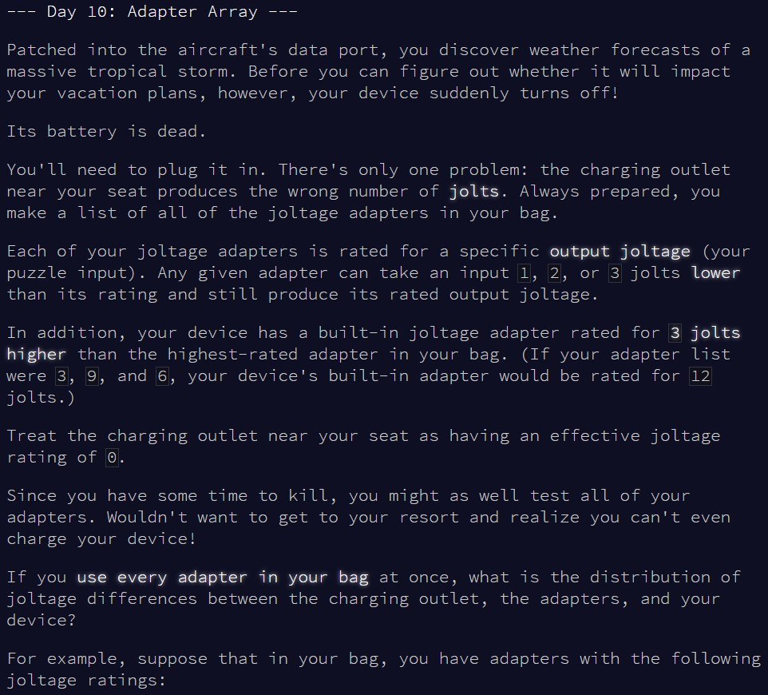
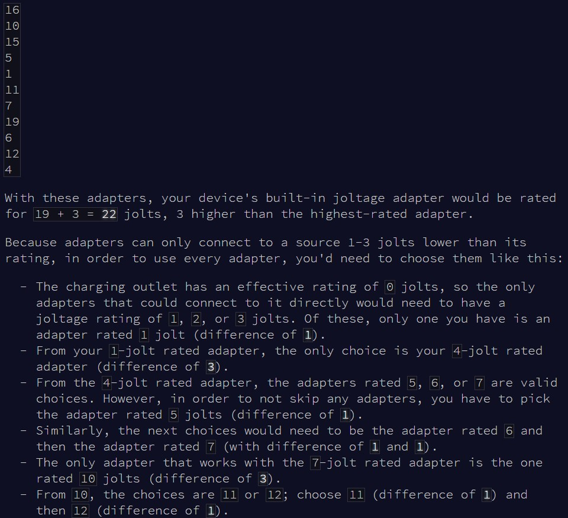
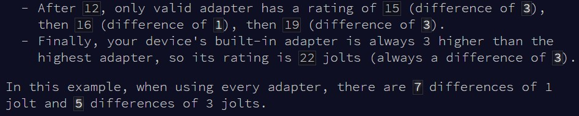
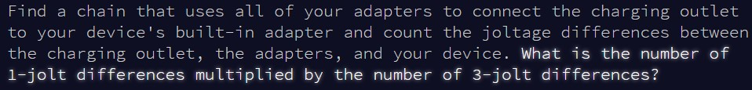
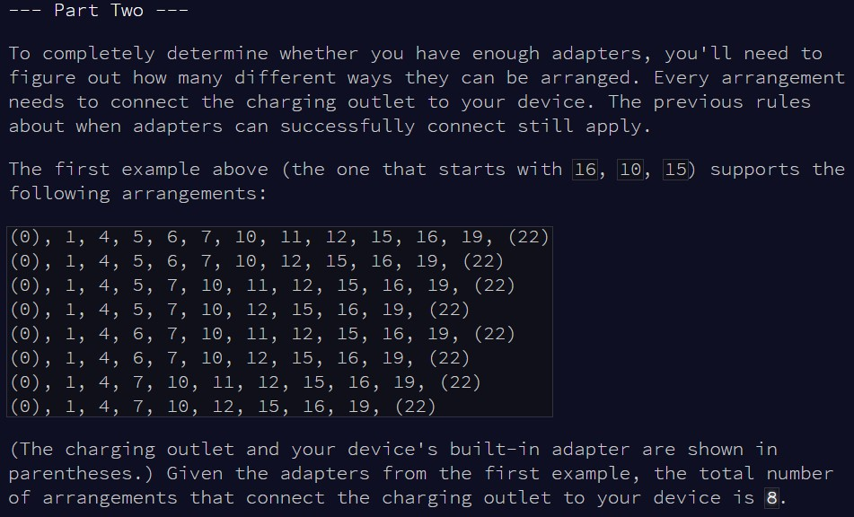
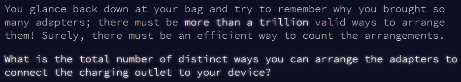

```{r setup, include=FALSE}
knitr::opts_chunk$set(echo = TRUE)
```

# Part 1

## Challenge

\
\
\
\

The challenge explanation today is very long (in fact I've skipped one of the
examples shown), but the solution is surprisingly compact!

## Solution

As we know that each adapter only accepts an input that is 1, 2 or 3 less than its
value, then we know that the sequence of adapters we are looking for is 
necessarily ordered from the adapter with the lowest value, to the highest value,
with the initial 0 joltage, and final maximum value plus 3 added in.

Then, we can just `diff()` to calculate the difference between each adapter, and
`table()` to count how many times 1 and 3 occur in the sequence. As this can all
be done in a couple of lines, I haven't implemented any function today:

```{r test_solution1}

input = as.numeric(readLines(here::here("inputs", "input10ex.txt")))

input = diff(c(0, sort(input), max(input)+3))

table(input)["3"] * table(input)["1"]

```

The example works, so now we can try with the main puzzle input:

```{r result1}

input = as.numeric(readLines(here::here("inputs", "input10.txt")))

input = diff(c(0, sort(input), max(input)+3))

table(input)["3"] * table(input)["1"]


```


# Part 2

## Challenge

\
\

Now we're looking for combinations of our sequence of adapters that would still
be valid (ie a difference between 2 successive adapters of no more than 3). Let's
see if we can keep this solution compact too...

## Solution

We can see that all of our adapter values are actually either separated by 1 or
3 (for this solution, we'll just work with the vector containing the difference
of the joltage values). We can rephrase the question to: starting from the
ordered sequence of all adapters, which ones could we take out while still keeping
a difference of at most 3 between 2 adjacent adapters? We can then calculate all
possible combinations of this, to figure out how many sequences are valid.

Working with our difference vector, we know that we can't take out 3s, because
this would create a create a gap between adapters higher than 3. We can split our
difference vector into chunks of 1s, figure out how many combinations are possible
for each chunk, then multiply everything together to figure out our final
number of combinations.

For example, consider the following adapter sequence: "1 4 5 6 9". Converting it
to difference between values, this gives "3 1 1 3" (ie "4-1 5-4 6-5 9-6"). There are
two 1s in this sequence. The only 2 valid combinations are either: keeping everything
("1 4 5 6 9"), or removing the 5 ("1 4 6 9").

Let's try again with "1 4 5 6 7 10". This converts to a difference sequence with 
three 1s ("3 1 1 1 3"). The only 4 valid options are: keeping everything 
("1 4 5 6 7 10"), removing the 5 ("1 4 6 7 10"), removing the 5 and 6 
("1 4 7 10"), or removing the 6 ("1 4 5 7 10"). 

Finally, with "1 4 5 6 7 8 11", this gives "3 1 1 1 1 3", ie four 1s. The 7 valid
options: keeping everything ("1 4 5 6 7 8 11"), removing the 5, removing the 5 and 6,
removing the 5 and 7, removing the 6, removing the 6 and 7, or removing the 7.

Let's recap:

1) "1 4 5 6 9" -> "3 1 1 3" -> two 1s -> 2 valid combinations
2) "1 4 5 6 7 10" -> "3 1 1 1 3" -> three 1s -> 4 valid combinations
3) "1 4 5 6 7 8 11" -> "3 1 1 1 1 3" -> four 1s -> 7 valid combinations

Simply put: number of valid combinations = sum(0:(number of 1s-1)) + 1
This holds true regardless of the number of 1s. So, we can cut up our difference
sequence into a bunch of 1s sequence, use the formula to calculate the number of
possible combinations for that chunk. Multiplying everything together then gives
us the total number of valid combinations for our entire sequence of adapters.

(NB: the reason we start the sum at 0 and not 1 is in case we have one 1 only. In
that case you can't remove anything from that sequence, so the formula should give
you a number of valid combinations of 1, ie the default sequence only)

Let's try with the example first:

```{r test_solution2}

input = as.numeric(readLines(here::here("inputs", "input10ex.txt")))

input = diff(c(0, sort(input), max(input)+3))

input = unlist(strsplit(paste(input, collapse = ""), "3"))
comb = 1
for(i in input){
  if(grepl("1", i)) comb = comb * (sum(0:(nchar(i)-1)) + 1)
}

comb

```

All good, we can apply the same logic to the main input:

```{r result2}

input = as.numeric(readLines(here::here("inputs", "input10.txt")))

input = diff(c(0, sort(input), max(input)+3))

input = unlist(strsplit(paste(input, collapse = ""), "3"))
comb = 1
for(i in input){
  if(grepl("1", i)) comb = comb * (sum(0:(nchar(i)-1)) + 1)
}

comb

```

Done! And it's also the first time that I ranked sub 10,000 (I was the 9372nd to
submit the correct answer for part 2 !)