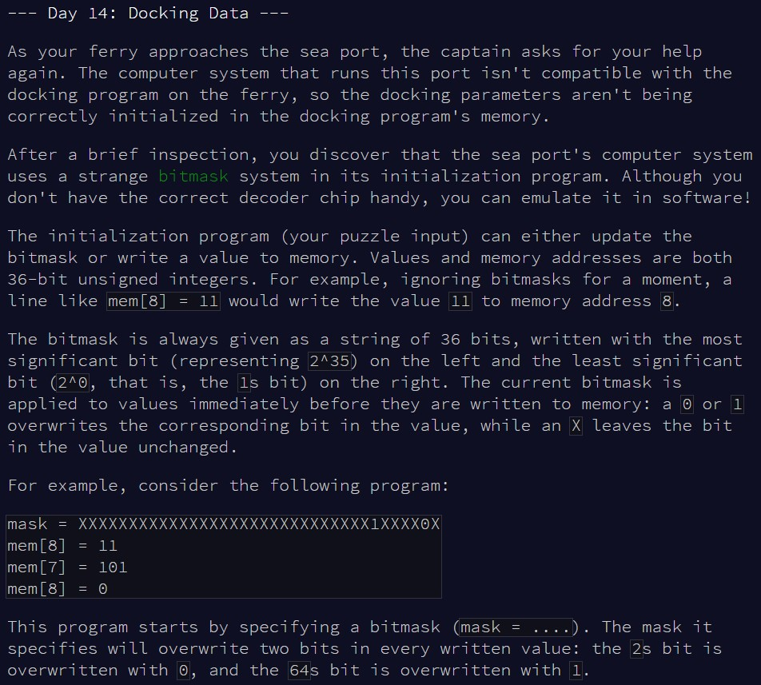
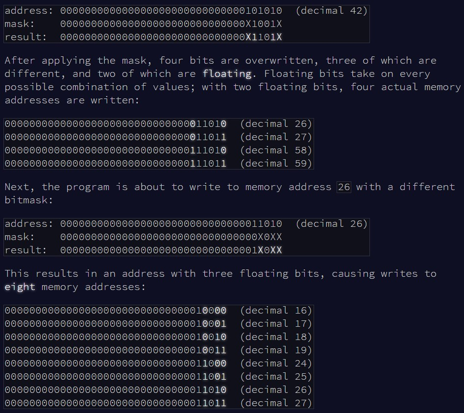
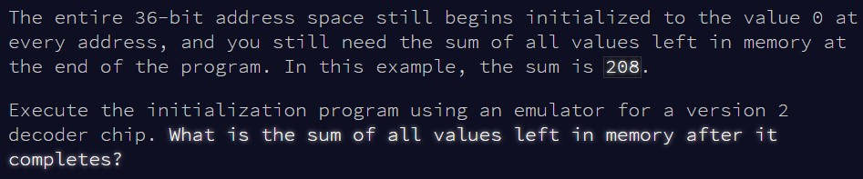

```{r setup, include=FALSE}
knitr::opts_chunk$set(echo = TRUE, warning = F)
library(bit64)
```

# Part 1

## Challenge

\
\

Today, we're playing around with bits, which is not something I'm used to do
at all, so let's see if I manage...

## Solution

As each line either updates the mask or provides us a value, we'll first
design our function in 2 parts, and identify which part to run based on the 
beginning of each input line (which is either "mask" or "mem[something]"). We need
to convert the values to binary strings as well. Here, we hit a limit in base `R`,
as the program only works with 32 bits by default, while here we are using 36 bits
values. So, I gave in and used the packages `bit64` and `compositions` to make
this work. This was to 1) overcome the 32 bits limit of the base `intToBits()`
function and 2) a weird limit of the function `strtoi()` which returns `NA` with
large values.

To apply the mask on the value, I work with strings, convert to single characters,
and overlay the mask only for values which are either 0 or 1 (ie not "X", which
I identify as `NA`s thanks to a quick conversion via `as.numeric()`). To store
the values, I use a named vector, assigning the memory position as the name of
values to store. This way, values will be automatically overwritten if the name
already exists in memory.


```{r solution1}

bitmask_system = function(input){
  
  #memory
  mem = c()
  
  #go through each input line
  for(i in 1:length(input)){
    
    #identify what the command is
    command = unlist(strsplit(input[i], " = "))[1]
    
    #if it's a mask, update the mask
    if(command == "mask"){
      
      #extract the mask value, break into single numbers
      mask = unlist(strsplit(input[i], " = "))[2]
      mask = as.numeric(unlist(strsplit(mask, "")))
      
    } else {
      
      #extract the location to store the value in memory after
      loc = gsub(".*?([0-9]+).*", "\\1", unlist(strsplit(input[i], " = "))[1])
      
      #extract the value as a 64bit string, then shorten to 36bits
      val = substring(as.bitstring(as.integer64(unlist(strsplit(input[i], " = "))[2])), 29)
      #break into single numbers
      val = as.numeric(unlist(strsplit(val, "")))
      
      #apply the mask on top of the value
      val[!is.na(mask)] = mask[!is.na(mask)]
      
      #paste it back as a single string, then convert back to a numeric value
      val = paste(val, collapse = "")
      val = compositions::unbinary(val)
      
      #store at the designated location
      mem[loc] = val
      
    }
    
  }
  
  #return the sum of all values in memory
  format(sum(mem), scientific = F)
  
}

```

Let's see if this works with the example.

```{r test_solution1}

input = readLines(here::here("inputs", "input14ex.txt"))

bitmask_system(input)

```

Looks fine, moving on to the main puzzle input!

```{r result1}

input = readLines(here::here("inputs", "input14.txt"))

bitmask_system(input)

```

Part 1 done!


# Part 2

## Challenge

\
\
\

Now, instead of applying the mask to the value, we're applying it to the
position. In addition, "X" are wildcards, so we'll have to work out all
possible combinations of positions...

## Solution

First things first, let's switch everything in our first function to apply the
mask to the position vector instead of the value vector. Once that's done,
the only challenge remaining is to work out all possible positions where we 
need to store our value (ie replace all "X" in the position vector to either 0
or 1). For this, we use `expand.grid()`, and then sequentially go through all
the resulting combinations, replacing the "X"s in our position vector to the
corresponding combination of 0 and 1, then store all the possible position
vectors. Final step: as above, we assign the value to named positions in memory
(note we don't need to convert back from binary to numeric for the positions,
as they're names, so it doesn't matter).

```{r solution2}

bitmask_system2 = function(input){
  
  #memory
  mem = c()
  
  #go through each input line
  for(i in 1:length(input)){
    
    #identify what the command is
    command = unlist(strsplit(input[i], " = "))[1]
    
    #if it's a mask, update the mask
    if(command == "mask"){
      
      #extract the mask value, break into single characters
      #NOTE not single numbers! As we need to know which are "X"s
      mask = unlist(strsplit(input[i], " = "))[2]
      mask = unlist(strsplit(mask, ""))
      
    } else {
      
      #extract the value to store
      val = as.numeric(unlist(strsplit(input[i], " = "))[2])
      
      #extract the location to store the value in memory after
      #extract as a 64bit string, then shorten to 36bits
      loc = gsub(".*?([0-9]+).*", "\\1", unlist(strsplit(input[i], " = "))[1])
      loc = substring(as.bitstring(as.integer64(loc)), 29)
      #break into single characters
      loc = unlist(strsplit(loc, ""))
      
      #apply the mask to the position
      loc[mask != 0] = mask[mask != 0]
      
      #vector to store all possible locations
      all_loc = c()
      
      #identify all combinations based on number of "X"s
      fillers = expand.grid(rep(list(c("0", "1")), sum(loc == "X")))
      fillers = sapply(fillers, as.character)
      
      #go through each possible combination
      for(j in 1:nrow(fillers)){
        
        #apply the combination to the position vector, and store it
        t_loc = loc
        t_loc[t_loc == "X"] = fillers[j,]
        t_loc = paste(t_loc, collapse = "")
        
        all_loc = c(all_loc, t_loc)
        
      }
      
      #save the value to all identified locations in memory
      mem[c(all_loc)] = val
      
    }
    
  }
  
  #return the sum of all values in memory
  format(sum(mem), scientific = F)
  
}


```

Let's go with the example!

```{r test_solution2}

input = readLines(here::here("inputs", "input14ex2.txt"))

bitmask_system2(input)

```

And now for the main input...

```{r result2}

input = readLines(here::here("inputs", "input14.txt"))

bitmask_system2(input)

```

It worked! That went better than I expected, phew
