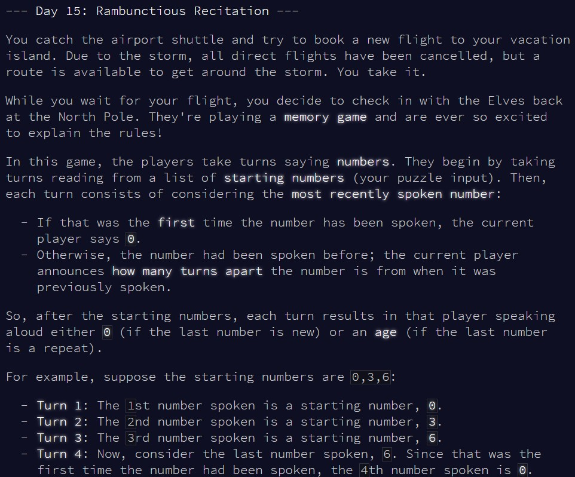
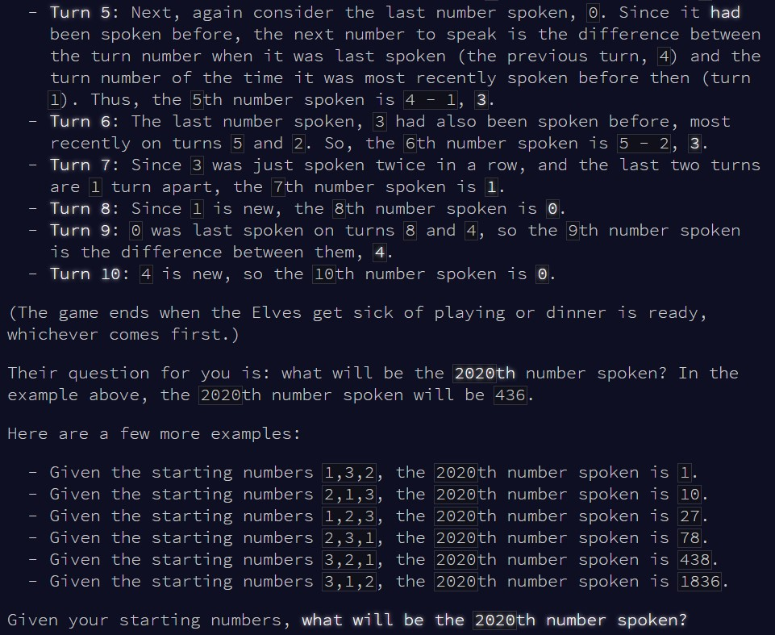
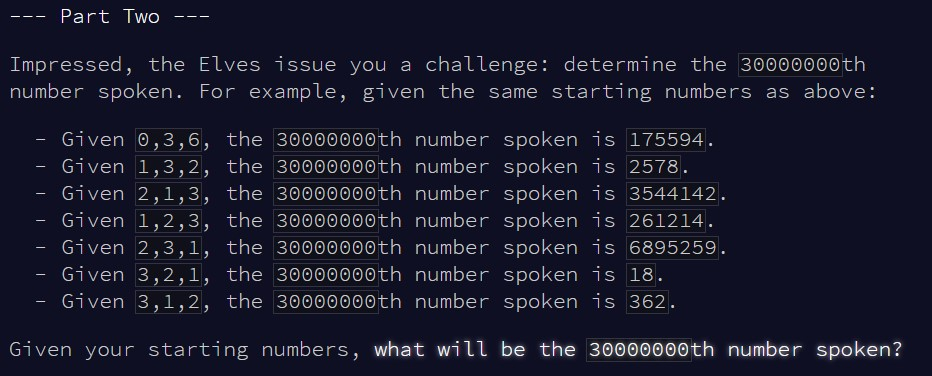

```{r setup, include=FALSE}
knitr::opts_chunk$set(echo = TRUE)
```

# Part 1

## Challenge

\
\

Today seems like a suspiciously simple problem, so I'm already scared for part 2...

## Solution

Here, we just need to look at the last value, check if it already appeared
before, and update the next value based on that. We can just do that with a 
single vector and a quick loop, no need for a function today.

```{r test_solution1}

input = c(0,3,6)

#extend the input to store all values up until the end point
val = c(input, rep(-1, 2020-length(input)))

#initial value to evaluate
last_val = tail(input, 1)

#keep evaluating values until we reach 2020
for(i in (length(input)+1):2020){
  
  #if the value hasn't appeared before, the answer is 0
  if(!(last_val %in% val[1:(i-2)])){
    
    last_val = 0
    val[i] = last_val
    
  } else {
    
    #if the value has appeared before, what's the difference between now and the last time it appeared
    last_val = i - 1 - tail(which(val[-(i-1)] == last_val), 1)
    val[i] = last_val
    
  }
  
}

#so, what's the 2020th value?
val[2020]

```

This worked with the example in less than a second, no reason to doubt the validity
of this solution for the main input!

```{r result1}

input = c(2,1,10,11,0,6)

val = c(input, rep(-1, 2020-length(input)))

last_val = tail(input, 1)

for(i in (length(input)+1):2020){
  
  if(!(last_val %in% val[1:(i-2)])){
    
    last_val = 0
    val[i] = last_val
    
  } else {
    
    last_val = i - 1 - tail(which(val[-(i-1)] == last_val), 1)
    val[i] = last_val
    
  }
  
}

val[2020]

```


# Part 2

## Challenge

\

So, the second part for today is exactly the same as the first one, except now
we're looking for the 30000000th value instead of the 2020th...

## Solution

Well, good news is that the solution above is still completely valid, we just
need to replace 2020 by 30000000. Bad news: this takes foreveeeer! I ended up
tweaking the loop a bunch of times, then realised I needed a much better indexing
system to make this work in a reasonable amount of time. My first attempt was
to only remember the last time each value was called, rather than remember all
values, but it still took too long to identify the values. I cut down another
step by overwriting the last time each value was called *before* checking
whether it had been called at all, but still then my indexing relying on a
named vector was too inefficient. In the end, I readapted this such that each
position in the vector corresponds to a value, and the value at that position
corresponds to the last time that the value was spoken (yikes!). Now, with
indexing by position rather than name, that worked much faster!


```{r result2}

#first part of the input
input = c(2,1,10,11,0)

#create vector of max size to store all possible values from 0 to 30M
val = rep(NA, 30000001)
#store the last time that the first values were called
val[input+1] = c(1:5)

#the next value
last_val = 6

#repeat until 30M
for(i in (length(input)+1):(30000000-1)){
  
  #remember the last time the value was called
  check = val[last_val+1]
  #store that the value was called now
  val[last_val+1] = i
  
  #if the value had not been called before, the next value is 0
  if(is.na(check)){
    
    last_val = 0
    
  } else {
    
    #if the value had been called before, the next value is the difference
    last_val = i - check
    
  }
  
}

last_val


```

