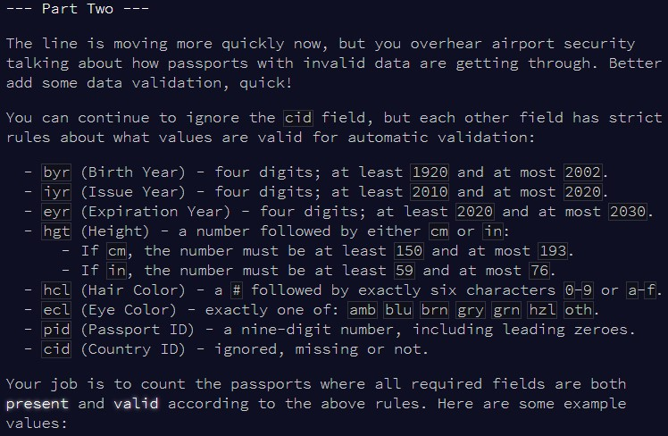

```{r setup, include=FALSE}
knitr::opts_chunk$set(echo = TRUE)
```

# Part 1

## Challenge

\


## Solution


```{r solution1}

weird_maths = function(input){
  
  all_vals = 0
  
  for(i in 1:length(input)){
    
    input_i = gsub(" ", "", input[i])
    input_split = unlist(strsplit(input_i, ""))
    
    repeat{
      
      #if any parenthesis, move to most nested level
      open_par = grep("\\(", input_split)
      if(length(open_par) > 0){
        in_par = TRUE
        sub_par_begin = max(open_par) + 1
        input_sub = input_split[sub_par_begin:length(input_split)]
        close_par = grep("\\)", input_sub)
        sub_par_end = min(close_par) - 1
        input_sub = input_sub[1:sub_par_end]
      } else {
        input_sub = input_split
        in_par = FALSE
      }
      
      repeat{
        
        sub_end = grep("[[:punct:]]", input_sub)
        
        if(length(sub_end) > 1){
          sub_end = sub_end[2] - 1
          final_operator = FALSE
        } else {
          sub_end = length(input_sub)
          final_operator = TRUE
        }
        
        input_sub_val = paste(input_sub[1:sub_end], collapse = "")
        input_sub_val = eval(parse(text = input_sub_val))
        
        if(final_operator) break
        
        input_sub = input_sub[-c(1:sub_end)]
        input_sub = c(input_sub_val, input_sub)
        
      }
      
      #if in par
      if(in_par){
        input_split[sub_par_begin-1] = input_sub_val
        input_split = input_split[-c(sub_par_begin:(sub_par_begin+sub_par_end))]
      } else {
        input_split = input_sub_val
      }
      
      if(length(input_split) == 1) break
      
    }
    
    all_vals = all_vals + input_split
    
  }
  
  all_vals
  
}


```


```{r test_solution1}

input = c("((2 + 4 * 9) * (6 + 9 * 8 + 6) + 6) + 2 + 4 * 2")
`-` <- `*` 
input = gsub("\\*", "\\-", input)
eval(parse(text = input))

weird_maths(input)

```


```{r result1}

input = readLines(here::here("inputs", "input18.txt"))
weird_maths(input)


```


# Part 2

## Challenge

\


## Solution


```{r solution2}

weird_maths2 = function(input){
  
  all_vals = 0
  
  for(i in 1:length(input)){
    
    input_i = gsub(" ", "", input[i])
    input_split = unlist(strsplit(input_i, ""))
    
    repeat{
      
      #if any parenthesis, move to most nested level
      open_par = grep("\\(", input_split)
      if(length(open_par) > 0){
        in_par = TRUE
        sub_par_begin = max(open_par) + 1
        input_sub = input_split[sub_par_begin:length(input_split)]
        close_par = grep("\\)", input_sub)
        sub_par_end = min(close_par) - 1
        input_sub = input_sub[1:sub_par_end]
      } else {
        input_sub = input_split
        in_par = FALSE
      }
      
      repeat{
        
        sub_end = grep("[[:punct:]]", input_sub)
        
        if(length(sub_end) > 1){
          sub_end = sub_end[2] - 1
          final_operator = FALSE
        } else {
          sub_end = length(input_sub)
          final_operator = TRUE
        }
        
        input_sub_val = paste(input_sub[1:sub_end], collapse = "")
        input_sub_val = eval(parse(text = input_sub_val))
        
        if(final_operator) break
        
        input_sub = input_sub[-c(1:sub_end)]
        input_sub = c(input_sub_val, input_sub)
        
      }
      
      #if in par
      if(in_par){
        input_split[sub_par_begin-1] = input_sub_val
        input_split = input_split[-c(sub_par_begin:(sub_par_begin+sub_par_end))]
      } else {
        input_split = input_sub_val
      }
      
      if(length(input_split) == 1) break
      
    }
    
    all_vals = all_vals + input_split
    
  }
  
  all_vals
  
}


```


```{r test_solution2}


```


```{r result2}


```

