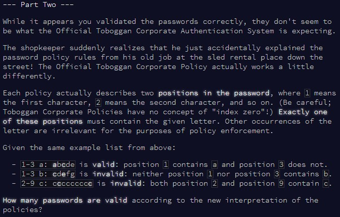

```{r setup, include=FALSE}
knitr::opts_chunk$set(echo = TRUE)
```

# Part 1

## Challenge

\

Today, we're hunting for patterns in strings! With a first step being to convert
each input line to something we can actually use...

## Solution

Quick note here - I'm aware there might be "cleaner" ways to do this, using the
`stringr` package for example, but I'm trying to stick to base `R` here!

For today, we're going to go through each line of the input sequentially, and
record whether that line is valid. I guess you could also try to evaluate this
using some sort of `apply()` method, but loops are arguably easier to read and
the potential speed difference won't be significant.

First thing is to convert the line into the 3 sections we need: **conditions**, 
**letter**, and **password**. Conveniently, these are all separated by a blank space,
so `strsplit()` will work perfectly. We then further split the **conditions** in 
two (min and max number of occurrence of the letter in the password), using the 
fact that the two conditions are separated by "-" in the string. Remember to
convert the conditions to numbers! (might have forgotten to do that in my initial
solution... oops!)

For the **letter**, we just need to clean it up by removing the ":", easily done
using `gsub()`. For the **password**, we also break it down into individual letters
to use with `grep()` as explained below.

To count how many times the **letter** occurs in the **password**, we use
`grep()` to find all matches, and `length()` to count how many we have. Clearly,
a less convoluted solution would have been to use `stringr::str_count`, but as I
said I'm trying to stick to base `R`...

Last step is just to evaluate whether the letter count is between the two
**conditions**, and record how many valid passwords we have!


```{r solution1}

find_password = function(input){
  
  pass_counter = 0
  
  for(i in 1:length(input)){
    
    #extract line i
    test_line = input[i]
    
    #extract the min and max condition
    condition = unlist(strsplit(test_line, " "))[1]
    condition_min = as.numeric(unlist(strsplit(condition, "-"))[1])
    condition_max = as.numeric(unlist(strsplit(condition, "-"))[2])
    
    #extract letter
    letter = unlist(strsplit(test_line, " "))[2]
    letter = gsub(":", "", letter)
    
    #extract password, and beak it down
    password = unlist(strsplit(test_line, " "))[3]
    password = unlist(strsplit(password, ""))

    #count letter occurrence
    letter_count = length(grep(letter, password))

    if(letter_count <= condition_max & letter_count >= condition_min){
      pass_counter = pass_counter + 1
    }
    
  }
  
  pass_counter
  
}

```

Checking whether this works with the example...

```{r test_solution1}

input = c("1-3 a: abcde",
          "1-3 b: cdefg",
          "2-9 c: ccccccccc")

find_password(input)

```

And now for the final result using the puzzle input!

```{r result1}

input = readLines(here::here("inputs", "input2.txt"))

find_password(input)


```


# Part 2

## Challenge

\

So now the **conditions** have become **positions**... luckily for us, the overall
structure hasn't really changed, so we won't have to adapt our solution too much.

## Solution

First things first, for clarity, let's rename **conditions** to **positions** in
our function. The rest is straightforward - as we're already using `grep()` to 
evaluate where in the **password** the **letter** occurs, we just need to check
whether these positions match the required **positions**. A quick way to do that
is to create another variable `check`, and give it `+1` for each matching **positions**.
Then, because we only want exactly one of the **positions** to match, we only
consider the password to be valid if `check` is equal to 1 !

```{r solution2}

find_password2 = function(input){
  
  pass_counter = 0
  
  for(i in 1:length(input)){
    
    #extract line i
    test_line = input[i]
    
    #extract the two positions
    positions = unlist(strsplit(test_line, " "))[1]
    position1 = as.numeric(unlist(strsplit(positions, "-"))[1])
    position2 = as.numeric(unlist(strsplit(positions, "-"))[2])
    
    #extract letter
    letter = unlist(strsplit(test_line, " "))[2]
    letter = gsub(":", "", letter)
    
    #extract password, and beak it down
    password = unlist(strsplit(test_line, " "))[3]
    password = unlist(strsplit(password, ""))

    #check password positions for letter
    letter_positions = grep(letter, password)

    #check whether letter positions match requirements
    check = 0
    if(position1 %in% letter_positions) check = check + 1
    if(position2 %in% letter_positions) check = check + 1

    #only record a valid password if exactly one of the requirements was met
    if(check == 1) pass_counter = pass_counter + 1
    
  }
  
  pass_counter
  
}

```

Let's check this works with the example.

```{r test_solution2}

input = c("1-3 a: abcde",
          "1-3 b: cdefg",
          "2-9 c: ccccccccc")

find_password2(input)

```

And finally, we can get our result for the 2nd part of today's puzzle!

```{r result2}

input = readLines(here::here("inputs", "input2.txt"))

find_password2(input)

```

