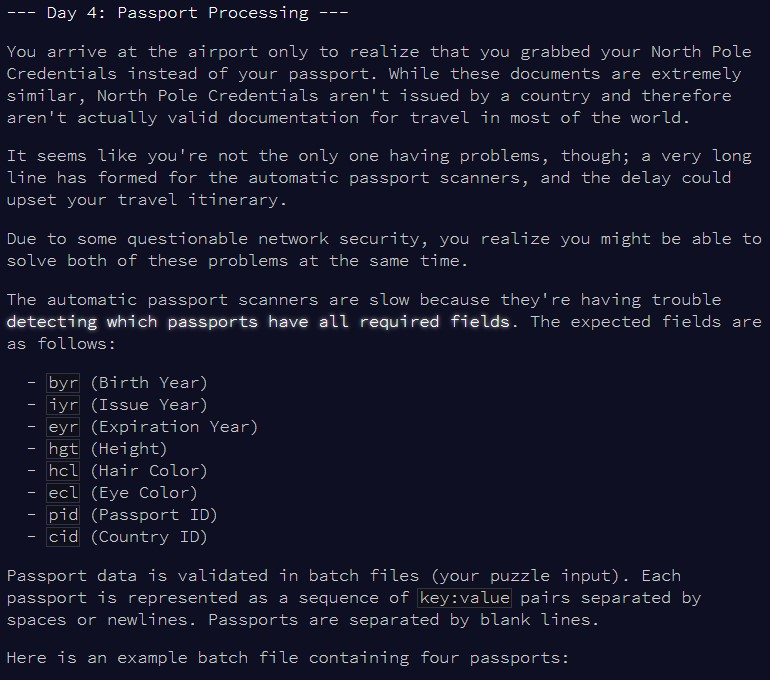
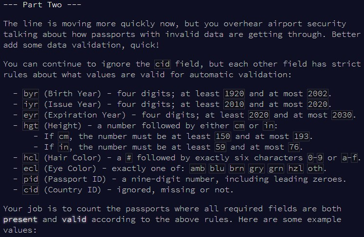

```{r setup, include=FALSE}
knitr::opts_chunk$set(echo = TRUE)
```

# Part 1

## Challenge

\


## Solution


```{r solution1}

find_encryption = function(door_public, card_public, subject = 7){
  
  i_max = 1
  j_max = 1
  door = 1
  card = 1
  
  repeat{
    door = door * subject
    door = door %% 20201227
    if(door == door_public) break
    i_max = i_max + 1
  }
  
  repeat{
    card = card * subject
    card = card %% 20201227
    if(card == card_public) break
    j_max = j_max + 1
  }
  
  door = 1
  card = 1
  
  for(i in 1:i_max){
    door = door * card_public
    door = door %% 20201227
  }
  
  for(j in 1:j_max){
    card = card * door_public
    card = card %% 20201227
  }
  
  
  print(i_max)
  print(j_max)
  print(door)
  print(card)
  
}

```


```{r test_solution1}

find_encryption(10705932, 12301431)

```


```{r result1}


```


# Part 2

## Challenge

\


## Solution


```{r solution2}


```


```{r test_solution2}


```


```{r result2}


```

