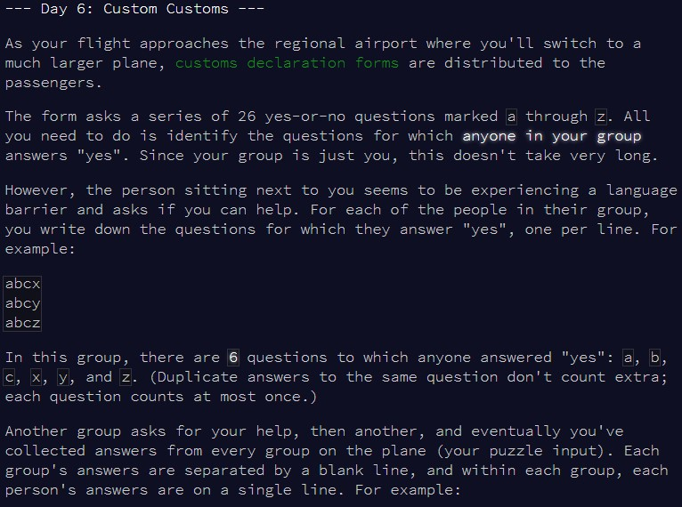
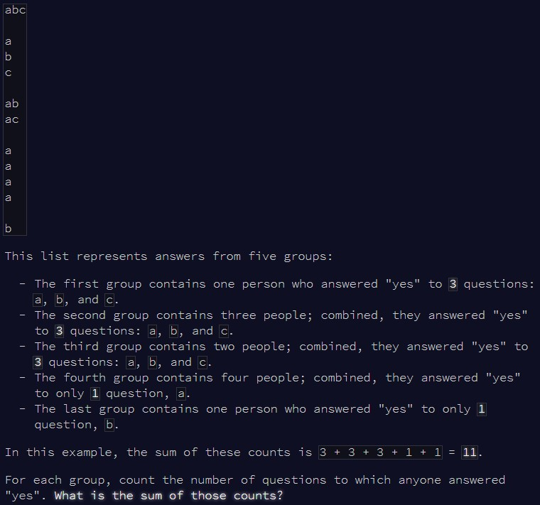
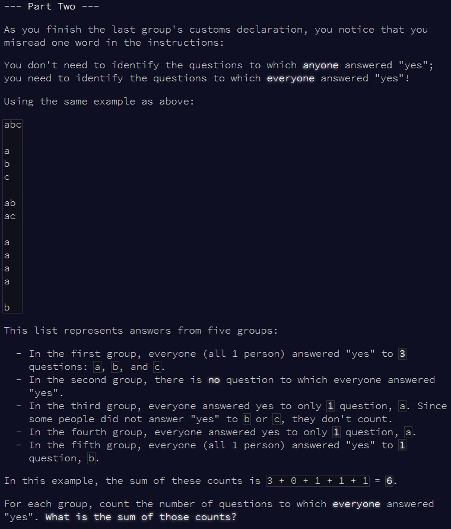

```{r setup, include=FALSE}
knitr::opts_chunk$set(echo = TRUE)
```

# Part 1

## Challenge

\
\

Today, more strings to break down, more patterns to find!

## Solution

To solve this we need to format our input into something clear. As we're interested
in the answers from groups, not individual members, we can just regroup all the
individual answers together by group. Then, for each group, we use the `unique()`
function to remove duplicates and count how many questions were answered "yes"
by at least one member of the group.

```{r solution1}

count_yes = function(input){
  
  #store total counts
  total_count = 0
  
  #go through each group
  for(i in 1:length(input)){
    
    #break down into individual characters to use with unique()
    test_group = input[i]
    test_group = unlist(strsplit(test_group, ""))
    
    #count how many questions have at least 1 answer in the group
    total_count = total_count + length(unique(test_group))
    
  }
  
  total_count
  
}


```

I'm skipping the example to go faster (it's Sunday!), and going straight to the
main puzzle input:

```{r result1}

#pay attention to the formatting here, it's essential to make this puzzle easy to solve
input = readLines(here::here("inputs", "input6.txt"))
input = paste(x=input, collapse="-")
input = unlist(strsplit(input, "--"))
input = gsub("-", "", input)

count_yes(input)

```


# Part 2

## Challenge

\

So now we do want to keep the members of a group separate somehow, as we need
to know how many members are in each group...

## Solution

We adapt our initial formatting of the puzzle input to remove that last step.
This means that now, the answers from each member of a group are separated by
"-". So, there are as many *n* members of a group than "-" characters, plus one. Once
we know this, we look for how many characters are repeated *n* times in all the
answers from the group!

```{r solution2}

count_yes2 = function(input){
  
  #store total counts
  total_count = 0
  
  #go through each group
  for(i in 1:length(input)){
    
    #break down into individual characters to use with unique()
    test_group = input[i]
    test_group = unlist(strsplit(test_group, ""))
    
    #because we didn't clean up the input all the way, each "-" separates 2 members
    #so, in the group, there are n("-")+1 members
    group_size = length(grep("-", test_group)) + 1
    
    #count how many times each question was answered, only keeping the ones where
    #all members answered
    group_count = sum(table(test_group) == group_size, na.rm = T)
    
    total_count = total_count + group_count
    
  }
  
  total_count
  
}

```

Skipping the example again, straight to the main input:

```{r result2}

#pay attention to the formatting here, it's essential to make this puzzle easy to solve
input = readLines(here::here("inputs", "input6.txt"))
input = paste(x=input, collapse="-")
input = unlist(strsplit(input, "--"))

count_yes2(input)

```

Solved! 
