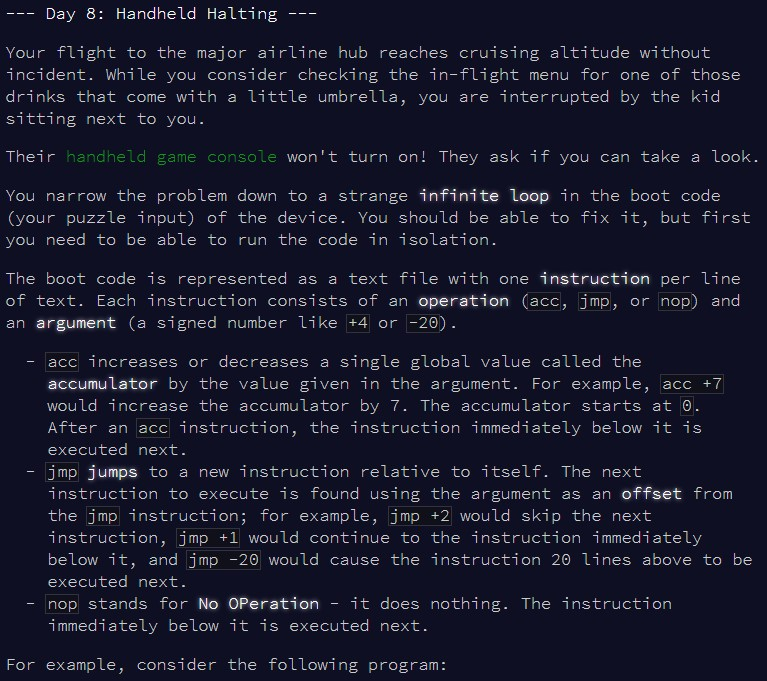
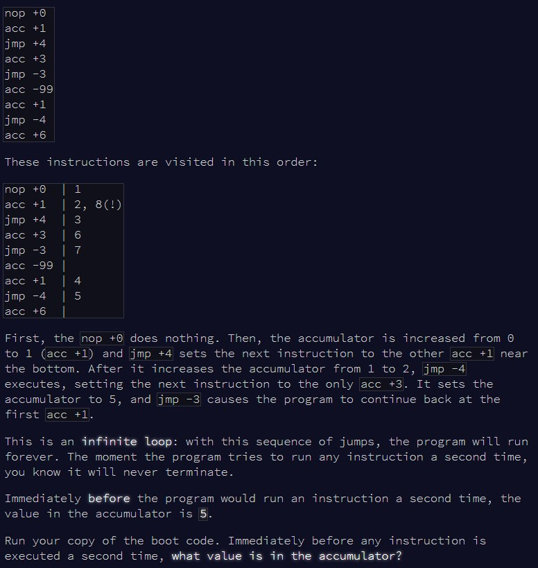
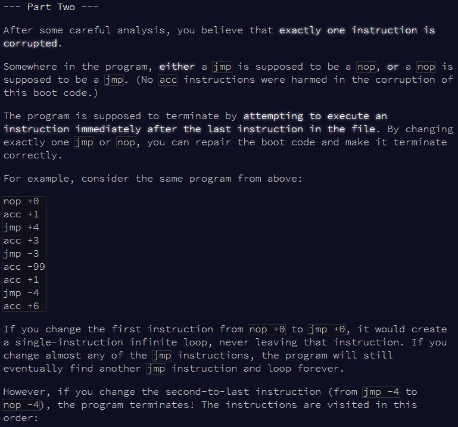
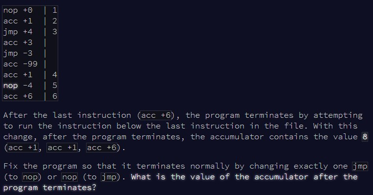

```{r setup, include=FALSE}
knitr::opts_chunk$set(echo = TRUE)
```

# Part 1

## Challenge

\
\

After [yesterdays' failure](https://htmlpreview.github.io/?https://github.com/qleclerc/adventofcode20/blob/master/reports/day7.html) I was a bit scared to face today's puzzle. Fortunately, it went
well! Today, we're back to converting strings to instructions to follow.

## Solution

Each line of the puzzle input contains two parts: a **key** (nop, acc or jmp) and
a **value**. So, I start by reformatting the puzzle input to a named vector, to
make it easier to work with in the function. For the first part of the puzzle, I
just need to keep going through each step, following the corresponding instruction,
until I reach a position that I already visited before.

```{r solution1}

calc_accumulator = function(input){
  
  #vector to store positions already visited
  i_mem = c()
  i = 1
  acc = 0
  
  #stop if I've already visited the position
  while(!(i %in% i_mem)){
    
    #remember that I visited this new position
    i_mem = c(i_mem, i)
    #extract the key and value at that position
    test_input = input[i]
    
    #perform the action corresponding to the key
    if(names(test_input) == "acc"){
      acc = acc + test_input
      i = i + 1
    }
    if(names(test_input) == "jmp"){
      i = i + test_input
    }
    if(names(test_input) == "nop"){
      i = i + 1
    }
    
  }
  
  acc
  
}

```

Let's see if this works with the example!

```{r test_solution1}

#quick reformatting of the input to a named key:value vector
input = readLines(here::here("inputs", "input8ex.txt"))
input_v = as.numeric(gsub(".* ", "", input))
names(input_v) = gsub(" .*", "", input)

calc_accumulator(input_v)

```

Seems fine, but after yesterday I'm cautious. Crossing my fingers for the main
puzzle input:

```{r result1}

input = readLines(here::here("inputs", "input8.txt"))
input_v = as.numeric(gsub(".* ", "", input))
names(input_v) = gsub(" .*", "", input)

calc_accumulator(input_v)

```

That was the right answer!


# Part 2

## Challenge

\
\

Now, we're still following instructions, but we have to keep replacing a single
key in the input, until the program can terminate and not run infinitely.

## Solution

Keeping the above structure, I can adjust to throw in a "reset" section. If the
program is running infinitely (ie I come back to a position I already visited
before), then I reset everything, change a new "jmp" to "nop" (or "nop" to "jmp),
and start again. As soon as my position is greater than the length of the input,
I know I've reached the end, and can break out of the loop!

```{r solution2}

calc_accumulator2 = function(input){
  
    #vector to store positions already visited
  i_mem = c()
  i = 1
  acc = 0
  
  #store the default input to reset when needed
  default_input = input
  #identify which keys I can change in the input
  change_vals = which(names(default_input) %in% c("jmp", "nop"))
  j = 1
  
  while(TRUE){
    
    #stop if my position is greater than the input (ie the program ran all the way)
    if(i > length(input)) break
    
    #if the program runs infinitely, stop and reset everything
    if(i %in% i_mem){
      
      #reset
      i_mem = c()
      i = 1
      acc = 0
      input = default_input
      
      #change the next jmp or pos value
      if(names(input)[change_vals[j]] == "jmp"){
        names(input)[change_vals[j]] = "nop"
      } else names(input)[change_vals[j]] = "jmp"
      
      j = j + 1 
      
    }
    
    #remember that I visited this new position
    i_mem = c(i_mem, i)
    #extract the key and value at that position
    test_input = input[i]
    
    #perform the action corresponding to the key
    if(names(test_input) == "acc"){
      acc = acc + test_input
      i = i + 1
    }
    if(names(test_input) == "jmp"){
      i = i + test_input
    }
    if(names(test_input) == "nop"){
      i = i + 1
    }
    
  }
  
  acc
  
}

```

Let's check whether this works with the example:

```{r test_solution2}

input = readLines(here::here("inputs", "input8ex.txt"))
input_v = as.numeric(gsub(".* ", "", input))
names(input_v) = gsub(" .*", "", input)

calc_accumulator2(input_v)

```

And finally, let's see if we get the right answer with the main puzzle input:

```{r result2}

input = readLines(here::here("inputs", "input8.txt"))
input_v = as.numeric(gsub(".* ", "", input))
names(input_v) = gsub(" .*", "", input)

calc_accumulator2(input_v)


```

Success! A good redemption after the struggle of day 7. Self-confidence restored!
