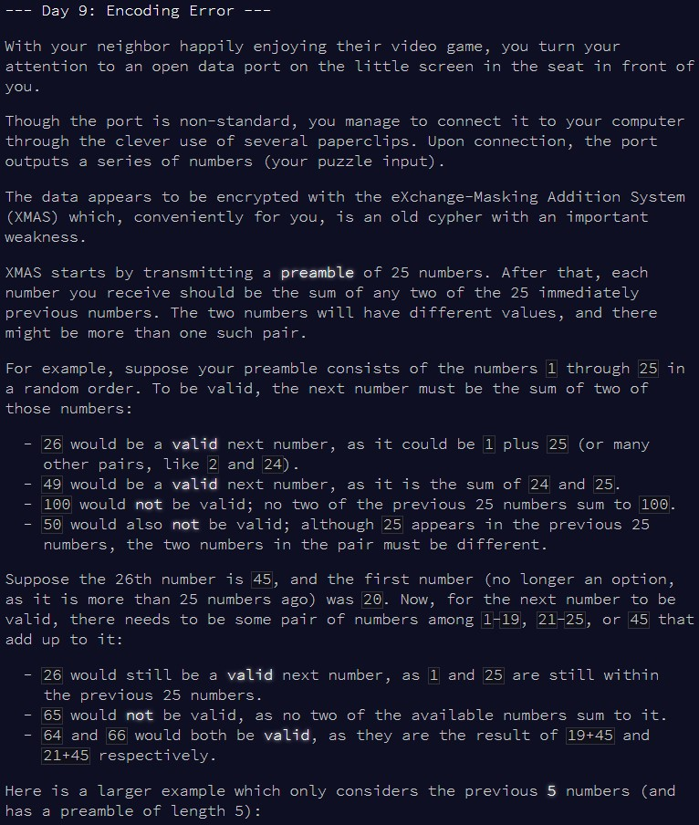
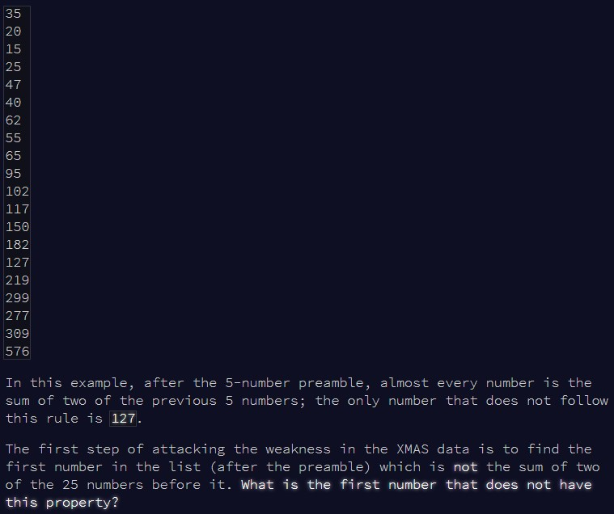
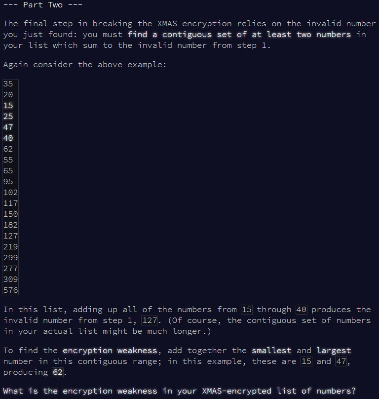

```{r setup, include=FALSE}
knitr::opts_chunk$set(echo = TRUE)
```

# Part 1

## Challenge

\
\

Today, we're taking a target value, and looking if two numbers in a defined
array sum to this value. Hold on, that's the same idea as
[day 1](https://htmlpreview.github.io/?https://github.com/qleclerc/adventofcode20/blob/master/reports/day1.html) !
So, we'll use a similar approach to solve this.

## Solution

The idea is to rephrase the problem here. Instead of saying "are there any 2 values
**x** and **y** in the vector that sum to **z**?", we're going to ask ourselves
"is the value **y**, defined as **y** = **z** - **x**, present in the vector?".
We go through each **z** position in the vector, always looking for a valid pair
of **x** and **y** values in the 25 values before **z** (or 5 values, in the case
of the example input). We stop as soon as we can't find a pair of **x** and **y**
values for a given **z** - that's the weakness we're looking for!

```{r solution1}

find_weakness = function(input, pre){
  
  #start looking at the first position after the preamble
  i = pre + 1
  
  #keep going until we find the weakness
  repeat{
    
    #what's our z value
    test_num = input[i]
    #what's our range of values to look for x and y
    test_prev = input[(i-pre):(i-1)]
    
    #go to the next z value as soon as we find a valid x and y pair
    valid = FALSE
    
    #sequentially test x values in the range
    for(j in test_prev){
      
      #what's our y value?
      target = test_num - j
      
      #if y is in range, z is valid, so we can move on to the next z
      if(target != j & target %in% test_prev){
        valid = TRUE
        i = i + 1
        break
      }
      
    }
    
    #if we went through all x and y combinations and didn't find anything valid,
    #then z failed!
    if(!valid){
      cat("The first number to fail is", test_num)
      break
    }
    
  }
  
}

```

With the example, we're only using a preamble of size 5:

```{r test_solution1}

input = as.numeric(readLines(here::here("inputs", "input9ex.txt")))

find_weakness(input, 5)

```

Onto the main puzzle input, with a preamble of 25:

```{r result1}

input = as.numeric(readLines(here::here("inputs", "input9.txt")))

find_weakness(input, 25)

```


# Part 2

## Challenge

\

Can't think of an elegant solution here, so looks like we're just going to go
through all possible ranges until we find something that works!

## Solution

The first section of the function is identical to above, just for completeness.
Then, we start with the first range of values (ie from positions 1 to 2), and
check if they sum to our target value. If not, we extend the range (ie from 
positions 1 to 3) and repeat. If our range reaches the end of the vector, we 
reset, increasing the minimum position in the range by 1 (ie from positions 2 to
3) and repeat. As soon as we have a range of values which sum to our target, we
stop!

```{r solution2}

find_weakness2 = function(input, pre){
  
  #same as above
  i = pre + 1
  
  while(TRUE){
    
    test_num = input[i]
    test_prev = input[(i-pre):(i-1)]
    
    valid = FALSE
    
    for(j in test_prev){
      
      target = test_num - j
      if(target != j & target %in% test_prev){
        valid = TRUE
        break
      }
      
    }
    
    if(!valid){
      cat("The first number to fail is", test_num)
      break
    }
    
    i = i + 1
    
  }
  
  
  #stop as soon as a range of values sums to our target
  finish = FALSE
  
  #start minimum range at 1, then progressively increase
  for(range_min in 1:(length(input)-1)){
    #start maximum range at min range + 1, then progressively extend
    for(range_max in (range_min+1):length(input)){
      
      #if the sum of values in the range matches our target, we win!
      if(sum(input[range_min:range_max]) == test_num){
        
        cat("\nRange min:", min(input[range_min:range_max]),
            "\nRange max:", max(input[range_min:range_max]),
            "\nTotal:", min(input[range_min:range_max]) + max(input[range_min:range_max]))
        
        finish = TRUE
        break
        
      }
      
    }
    
    if(finish) break
    
  }
  
}


```

Testing with the example:

```{r test_solution2}

input = as.numeric(readLines(here::here("inputs", "input9ex.txt")))

find_weakness2(input, 5)

```

And now with the main input:

```{r result2}

input = as.numeric(readLines(here::here("inputs", "input9.txt")))

find_weakness2(input, 25)

```

Done!
