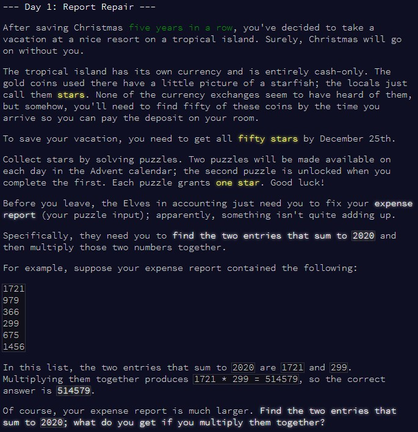
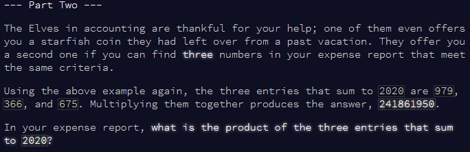

```{r setup, include=FALSE}
knitr::opts_chunk$set(echo = TRUE)
```

# Part 1

## Challenge

\

So, for our first challenge, we have to search a list of numbers for a combination
of any 2 numbers that add up to 2020, and our final result should be the product
of these 2 numbers.


## Solution

My first thought was to setup a `for` loop to go over all possible combinations.
Let's consider we're looking at the number at position `i` in the vector. As we
know that our target value is 2020, we could sequentially check whether the sum
of `i` and each other number in the vector is 2020. If so, we've got our answer,
if not, we move on to the number at position `i+1` and repeat. However, there is
a simpler way!

As we know that our target is 2020, and there is only one pair of value that adds
up to this, we can simply subtract number `i` from 2020, then see whether this
new value is in the vector. If so, we've got our answer!


```{r solution1}

find2020 = function(input){
  
  i = 1
  
  #no need for a limit in the loop, we'll break when we have our answer
  while(TRUE){
    
    testnum = input[i] #our value at position i
    target = 2020 - testnum #our target
    
    #if our target is in the vector, we win!
    if(target %in% input){
      
      result = testnum * target #calculate our final result
      break #exit the loop
      
    }
    
    #otherwise, just move on to the next value and repeat
    i = i + 1
    
  }
  
  cat("Pair of numbers:", testnum, "and", target,
      "\nResult:", result)
  
}


```

Let's first test whether this solution aligns with the example.

```{r test_solution1}

input = c(1721,
          979,
          366,
          299,
          675,
          1456)

find2020(input)

```

It works! Now let's try it with our puzzle input.

```{r result1}

input = c(1755,   1668, 837,  1900,  1687, 1901,  1765,  1963,  1945, 1791,  1688,
          1792,  1865, 1833,  1811,  438, 1862, 1851,1877,   1808, 1253, 1933,1578,
          1841, 1871, 1784,1567, 1797, 1941, 1747,1787,   1744, 1450, 1795,1602,
          1972, 1946, 1827,1950, 1704, 547,  1971,  1910, 1502,  1750,  1967,
          1656, 1834,  1754,  1446,  1678, 1647,  1695,  1525,  1923, 1488,  1829,
          1848, 1766, 1662,  1724,  1897,  1751, 1823,  1540,  1736,  1929, 1772,
          1778, 1732, 1948, 1691,  1820,  1788,  1601, 1708,  2005,  1543,  1990,
          1666, 1994, 1689, 1980, 1839,  2008,  1801,  1592, 1739,  1845,  1434,
          360,  1828, 1942, 1713, 1721,  1984,  1966,  2006, 1459,  1944,  1849,
          1959, 1740, 1692, 1842,  1999, 1711,  1702,  1777,  1222, 1745,  686,
          1447,2002, 1895, 1590, 1498,1643,   1870, 412,  73,  1467, 1917,  1438,
          2001, 1758, 1810,  1425,  1969,  1884, 1534,  1761,  1512,  1937, 1654,
          1796, 1495,  1996, 1473,  1831,  1988,  1469, 1924,  1621,  1403,  1746,
          1998, 1858,  1706,  1798, 1978,  1559,  1898, 1815, 1623,  1785,  1753,
          1436, 608, 1652,  1940, 336, 1894, 1454,1599, 1604, 1975, 1881,1716,
          1878, 1595, 1928,1550, 1414, 1962, 1607,1756, 1986, 1775, 1952,1415,
          1864, 1813, 650, 1492, 1960, 641, 1953, 1873, 1985,1588,  1680, 1817,
          1685,1723, 1799, 1640, 1479,1912,  1638)

find2020(input)

```

And we've got it! Onto the second part...


# Part 2

## Challenge

\

Similar problem as above, but now it's the sum of 3 numbers that should add up
to 2020, not 2 numbers... We have to change our solution a bit!

## Solution

Again, here I could have switched to a more thorough step by step check, but I
thought that maybe I could simply extend my first solution. Effectively, this new
challenge just requires an extra step to be solved.

Instead of looking for a number in the vector that **matches** `2020 - input[i]`,
now we're effectively looking for 2 numbers which **add up to** `2020 - input[i]`.
So, the logic is to first work out what `2020 - input[i]` is, then for each other
number `j` in the vector, test whether the value `2020 - input[i] - input[j]` 
exists in the vector. If so, we've got our answer!

```{r solution2}

find2020_extend = function(input){
  
  i = 1
  result = 0 #define result here, enabling a check below to break if we find the answer
  
  while(TRUE){
    
    testnum = input[i]
    target = 2020 - testnum #first target
    
    for(j in c(1:length(input))[-i]){
      
      testnum2 = input[j]
      target2 = target - testnum2 #second target
      #if target2 is in the vector, then we know that the sum of target2,
      # testnum2 and testnum is 2020!
      
      if(target2 %in% input){
        
        result =  testnum * testnum2 * target2
        break #break from the for loop if we've got a match
        
      }
    }
    
    if(result != 0) break #break from the while loop if we've got a result
    
    #otherwise, just move on to the next value and repeat
    i = i + 1
    
  }
  
  cat("Trio of numbers:", testnum, ",", testnum2, "and", target2,
      "\nResult:", result)
  
}


```

Testing with the example...

```{r test_solution2}

input = c(1721,
          979,
          366,
          299,
          675,
          1456)

find2020_extend(input)

```

All good! So, final result:

```{r result2}

input = c(1755,   1668, 837,  1900,  1687, 1901,  1765,  1963,  1945, 1791,  1688,
          1792,  1865, 1833,  1811,  438, 1862, 1851,1877,   1808, 1253, 1933,1578,
          1841, 1871, 1784,1567, 1797, 1941, 1747,1787,   1744, 1450, 1795,1602,
          1972, 1946, 1827,1950, 1704, 547,  1971,  1910, 1502,  1750,  1967,
          1656, 1834,  1754,  1446,  1678, 1647,  1695,  1525,  1923, 1488,  1829,
          1848, 1766, 1662,  1724,  1897,  1751, 1823,  1540,  1736,  1929, 1772,
          1778, 1732, 1948, 1691,  1820,  1788,  1601, 1708,  2005,  1543,  1990,
          1666, 1994, 1689, 1980, 1839,  2008,  1801,  1592, 1739,  1845,  1434,
          360,  1828, 1942, 1713, 1721,  1984,  1966,  2006, 1459,  1944,  1849,
          1959, 1740, 1692, 1842,  1999, 1711,  1702,  1777,  1222, 1745,  686,
          1447,2002, 1895, 1590, 1498,1643,   1870, 412,  73,  1467, 1917,  1438,
          2001, 1758, 1810,  1425,  1969,  1884, 1534,  1761,  1512,  1937, 1654,
          1796, 1495,  1996, 1473,  1831,  1988,  1469, 1924,  1621,  1403,  1746,
          1998, 1858,  1706,  1798, 1978,  1559,  1898, 1815, 1623,  1785,  1753,
          1436, 608, 1652,  1940, 336, 1894, 1454,1599, 1604, 1975, 1881,1716,
          1878, 1595, 1928,1550, 1414, 1962, 1607,1756, 1986, 1775, 1952,1415,
          1864, 1813, 650, 1492, 1960, 641, 1953, 1873, 1985,1588,  1680, 1817,
          1685,1723, 1799, 1640, 1479,1912,  1638)

find2020_extend(input)

```

And that's the first day finished!
