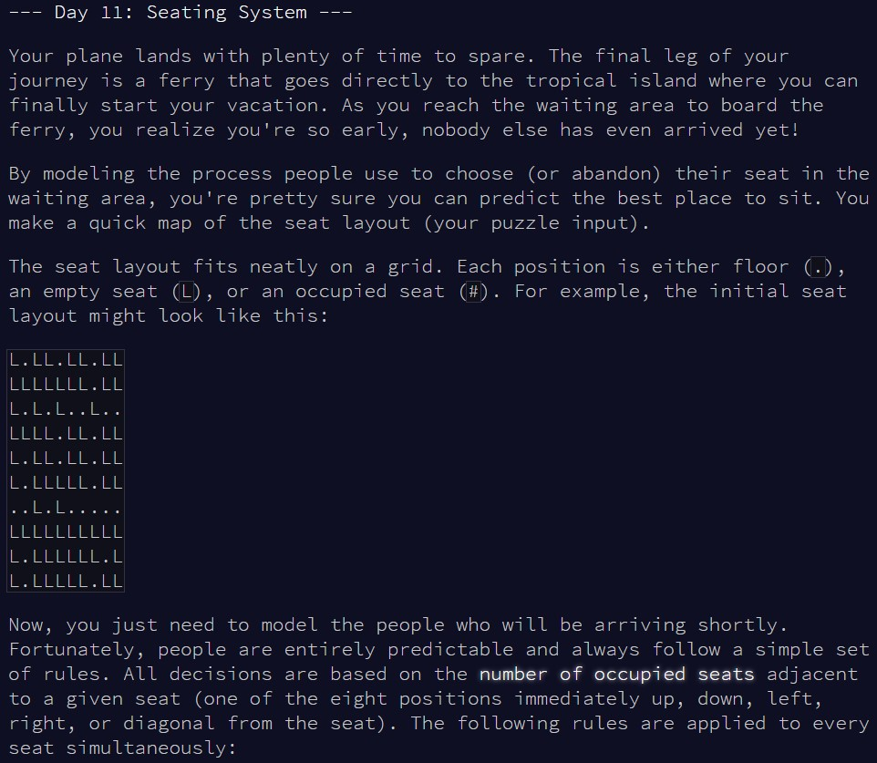
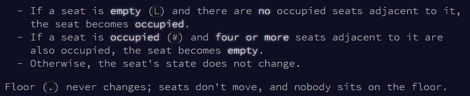
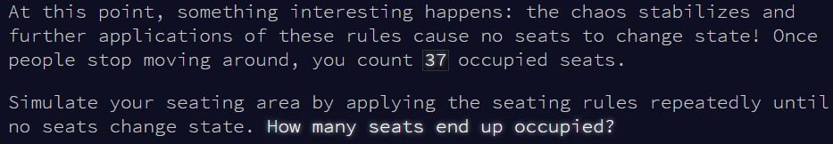
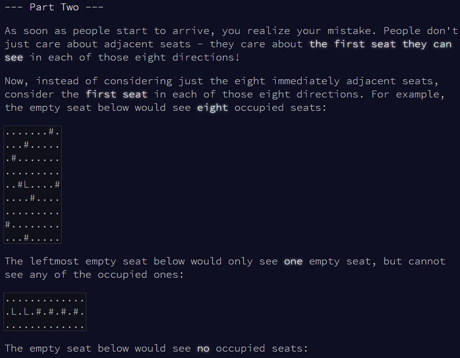
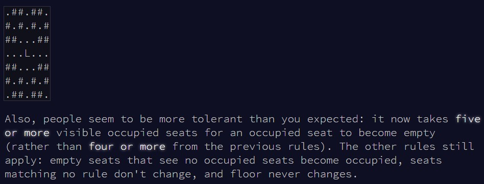
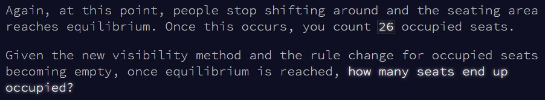

```{r setup, include=FALSE}
knitr::opts_chunk$set(echo = TRUE)
```

# Part 1

## Challenge

\
\
\

A similar problem than what we faced in
[day 3](https://htmlpreview.github.io/?https://github.com/qleclerc/adventofcode20/blob/master/reports/day3.html),
since we're trying to go through a matrix, evaluate values at different
positions, and perform an action based on the values.


## Solution

We have to be careful here to not update the values directly - the puzzle states
that all changes happen simultaneously, so if we want to go through this
sequentially we have to store the "old" seating arrangement, while progressively
updating a "new" seating arrangement. Only other thing to watch out for is the
fact that `R` fetches values based on `[row, column]` indexing, so if we work
with an `x` and `y` coordinates logic, we have to fetch values by their
position `[y, x]`, **not** `[x, y]`!

I don't think my solution is the most efficient, but the idea is to go through
each seat, check what the values for all seats around it are, then check whether
a condition is met to update the seat value. The only real trick I used was to
add an extra border around the input matrix, to not worry about the indexing
going over the limit. Instead of evaluating from 1 to `nrow(input)` or `ncol(input)`,
this allows me to safely evaluate up to `nrow(input)-1` and `ncol(input)-1`. I
assign the dummy value "e" to this extra border, and phrased the conditions in
such a way that these dummy values don't affect my results and are effectively
being ignored.


```{r solution1}

count_seats = function(input){
  
  #store the old seating arrangement
  old_seating = new_seating = input
  
  #go through each seat (ignoring the extra border area)
  for(x in 2:(ncol(old_seating)-1)){
    
    for(y in 2:(nrow(old_seating)-1)){
      
      #skip if the seat if floor
      if(old_seating[y, x] == ".") next
      
      #this is what my grid around a seat N looks like:
      # 1 2 3 
      # 4 N 5
      # 6 7 8
      
      #figure out what's in all the positions around my seat
      pos1 = old_seating[y-1, x-1]
      pos2 = old_seating[y-1, x]
      pos3 = old_seating[y-1, x+1]
      pos4 = old_seating[y, x-1]
      pos5 = old_seating[y, x+1]
      pos6 = old_seating[y+1, x-1]
      pos7 = old_seating[y+1, x]
      pos8 = old_seating[y+1, x+1]
      
      all_pos = c(pos1,pos2,pos3,pos4,pos5,pos6,pos7,pos8)
      
      
      #if the seat is empty and none around are occupied, seat becomes occupied
      if(old_seating[y, x] == "L" & !("#" %in% all_pos)) new_seating[y, x] = "#"
      
      #if seat is occupied and at least 4 around are occupied, seat becomes empty
      if(old_seating[y, x] == "#" & sum(grepl("#", all_pos)) >= 4) new_seating[y, x] = "L"
      
    }
  }
  
  #if the old seating is the same as the new seating, we've reached equilibrium!
  #if not, then just repeat the entire function
  if(!(identical(old_seating, new_seating))) count_seats(new_seating)
  else cat("Total number of occupied seats:", sum(grepl("#", new_seating)))
  
}


```

As always, let's check this works with the example first:

```{r test_solution1}

input = readLines(here::here("inputs", "input11ex.txt"))
input = matrix(unlist(strsplit(input, "")), nrow = length(input), byrow = T)

#add a border of "e" values around the matrix, to not worry about indexing limits
input = rbind(rep("e", 10), input)
input = rbind(input, rep("e", 10))
input = cbind(rep("e", 12), input)
input = cbind(input, rep("e", 12))

count_seats(input)

```

And now, let's use the main puzzle input:

```{r result1}

input = readLines(here::here("inputs", "input11.txt"))
input = matrix(unlist(strsplit(input, "")), nrow = length(input), byrow = T)

#add a border of "e" values around the matrix, to not worry about indexing limits
input = rbind(rep("e", ncol(input)), input)
input = rbind(input, rep("e", ncol(input)))
input = cbind(rep("e", nrow(input)), input)
input = cbind(input, rep("e", nrow(input)))

count_seats(input)

```


# Part 2

## Challenge

\
\
\

So now, instead of only evaluating the closest seats, we keep going in each
direction until we encounter an occupied seat, an empty seat, or the end of the
seating area...

## Solution

Here what we'll do is create a new function to keep moving in a specified
direction, until we find an occupied/empty seat, or reach the limit of the
seating area. This is roughly similar in idea to what we did for
[day 3](https://htmlpreview.github.io/?https://github.com/qleclerc/adventofcode20/blob/master/reports/day3.html).

The extra border of "e" values trick is even more useful here, as we can
essentially say "keep looking in the specified direction until you find a seat
that is not floor", ie a seat with a value different from ".". This means we'll
automatically stop once we've reached the limit of the seating area, as we'll
encounter an "e", and again don't have to worry about indexing.

```{r solution2}

count_seats2 = function(input){
  
  #store the old seating arrangement
  old_seating = new_seating = input
  
  #new function to keep looking in a direction until we see something that's not floor
  find_first = function(input, xstart, ystart, xvar, yvar){
    
    i = 1
    
    while(TRUE){
      
      #check what the value of the seat is
      test_val = input[(ystart+i*yvar), (xstart+i*xvar)]
      
      #if it's not floor, stop
      if(test_val != ".") break
      
      #otherwise, move on to the next seat in that direction
      i = i + 1
    }
    
    test_val
    
  }
  
  
  #go through each seat (ignoring the extra border area)
  for(x in 2:(ncol(old_seating)-1)){
    
    for(y in 2:(nrow(old_seating)-1)){
      
      #skip if the seat if floor
      if(old_seating[y, x] == ".") next
      
      #this is what my grid around a seat N looks like:
      # 1 2 3 
      # 4 N 5
      # 6 7 8
      
      #look in each direction and record the 1st thing we see that's not floor
      pos1 = find_first(old_seating, x, y, -1, -1)
      pos2 = find_first(old_seating, x, y, 0, -1)
      pos3 = find_first(old_seating, x, y, 1, -1)
      pos4 = find_first(old_seating, x, y, -1, 0)
      pos5 = find_first(old_seating, x, y, 1, 0)
      pos6 = find_first(old_seating, x, y, -1, 1)
      pos7 = find_first(old_seating, x, y, 0, 1)
      pos8 = find_first(old_seating, x, y, 1, 1)
      
      all_pos = c(pos1,pos2,pos3,pos4,pos5,pos6,pos7,pos8)
      
      #if the seat is empty and none in view are occupied, seat becomes occupied
      if(old_seating[y, x] == "L" & !("#" %in% all_pos)) new_seating[y, x] = "#"
      
      #if seat is occupied and at least 5 in view are occupied, seat becomes empty
      if(old_seating[y, x] == "#" & sum(grepl("#", all_pos)) >= 5) new_seating[y, x] = "L"
      
    }
  }
  
  #if the old seating is the same as the new seating, we've reached equilibrium!
  #if not, then just repeat the entire function
  if(!(identical(old_seating, new_seating))) count_seats2(new_seating)
  else cat("Total number of occupied seats:", sum(grepl("#", new_seating)))
  
}


```

Fingers crossed we haven't messed up any of the indexing...

```{r test_solution2}

input = readLines(here::here("inputs", "input11ex.txt"))
input = matrix(unlist(strsplit(input, "")), nrow = length(input), byrow = T)

#add a border of "e" values around the matrix, to not worry about indexing limits
input = rbind(rep("e", 10), input)
input = rbind(input, rep("e", 10))
input = cbind(rep("e", 12), input)
input = cbind(input, rep("e", 12))

count_seats2(input)

```

Seems fine! Let's move on to the main input:

```{r result2}

input = readLines(here::here("inputs", "input11.txt"))
input = matrix(unlist(strsplit(input, "")), nrow = length(input), byrow = T)

#add a border of "e" values around the matrix, to not worry about indexing limits
input = rbind(rep("e", ncol(input)), input)
input = rbind(input, rep("e", ncol(input)))
input = cbind(rep("e", nrow(input)), input)
input = cbind(input, rep("e", nrow(input)))

count_seats2(input)


```

Surely not the most efficient solution, but it works!

