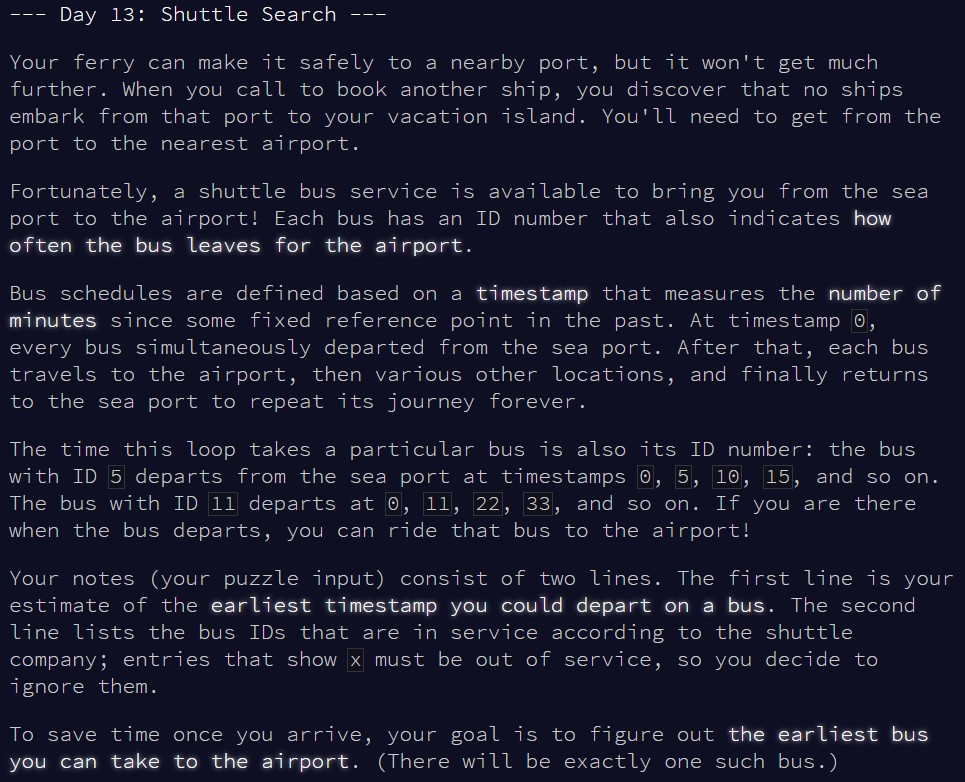
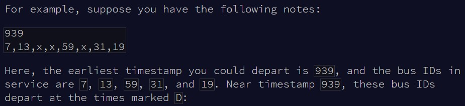
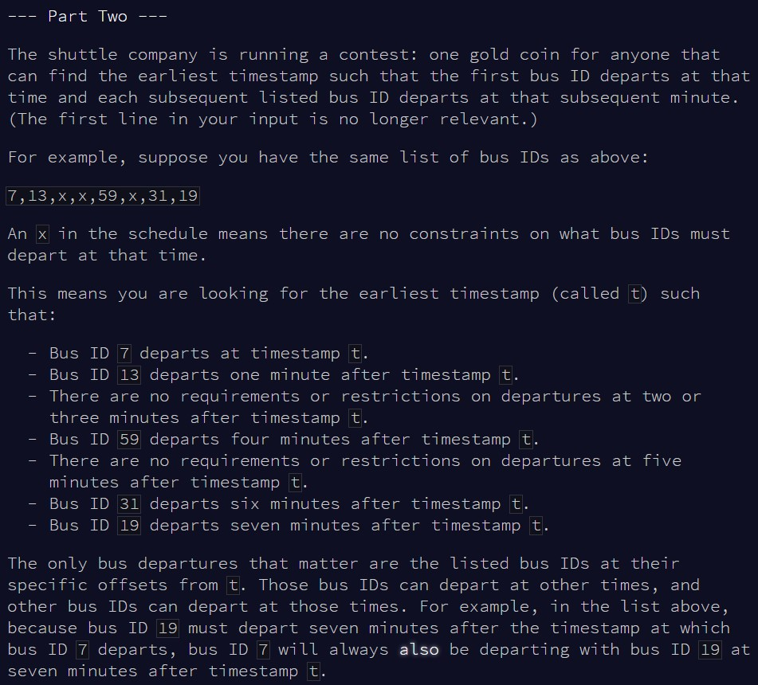

```{r setup, include=FALSE}
knitr::opts_chunk$set(echo = TRUE, warning = F)
```

# Part 1

## Challenge

\
\
\


## Solution

Part 1 can be solved really quickly; as we know what time *T* we arrive at the bus
stop, we can divide *T* by each bus ID, round up, then remultiply each bus ID
by the corresponding value. This will effectively give the first time greater
than *T* at which the corresponding bus will arrive. Then, the lowest time
corresponds to the first bus, the answer to our puzzle!

```{r test_solution1}

input = readLines(here::here("inputs", "input13ex.txt"))

#extract time T when we arrive at the bus stop
target = as.numeric(input[1])
#extract buses ID
buses = as.numeric(unlist(strsplit(input[2], ",")))
#figure out which the first times > T when the buses will arrive
times = buses * ceiling(target/buses)

#which is the first bus then?
(min(times, na.rm = T) - target) * buses[which.min(times)]

```


```{r result1}

input = readLines(here::here("inputs", "input13.txt"))

#extract time T when we arrive at the bus stop
target = as.numeric(input[1])
#extract buses ID
buses = as.numeric(unlist(strsplit(input[2], ",")))
#figure out which the first times > T when the buses will arrive
times = buses * ceiling(target/buses)

#which is the first bus then?
(min(times, na.rm = T) - target) * buses[which.min(times)]

```


# Part 2

## Challenge

\
\
\


## Solution

Part 2 unfortunately is still straightforward, but brute forcing takes forever...
The idea is to look for the first time *T* such that *T* is divisible by the first
bus ID, *T+1* is divisible by the second, *T+2* by the third etc... We can go
through each possible *T* sequentially, and stop as soon as we find a value
which can be divisible by the bus IDs appropriately. This is equivalent to 
saying that the modulo for all divisions is 0.

Unfortunately, the number of combinations is so high that, at the time I'm writing
this, it's still running... Clearly, there should be a more appropriate math
solution, but I don't know enough about this topic!

```{r test_solution2}

input = readLines(here::here("inputs", "input13ex.txt"))
buses = as.numeric(unlist(strsplit(input[2], ",")))

i = 1

repeat{
  
  #trick to make bigger jumps is to work with the "biggest" bus ID
  target = i*max(buses, na.rm = T)
  target = target - which.max(buses) + 1
  
  target = c(target:(length(buses)+target-1))
  
  #if all modulos are 0, we win!
  if(sum(target %% buses, na.rm = T) == 0){
    cat("Timestamp:", min(target))
    break
  }
  
  i = i + 1
      
}


```

Works perfectly fine with the example, but takes forever with the main input...

```{r result2}

# input = readLines(here::here("inputs", "input13.txt"))
# buses = as.numeric(unlist(strsplit(input[2], ",")))
# 
# i = 1000000000000
# 
# repeat{
#   
#   target = i*max(buses, na.rm = T)
#   target = target - which.max(buses) + 1
#   
#   target = c(target:(length(buses)+target-1))
#   
#   if(sum(target %% buses, na.rm = T) == 0){
#     cat("Timestamp:", min(target))
#     break
#   }
#   
#   i = i + 1
#       
# }
# 

```

