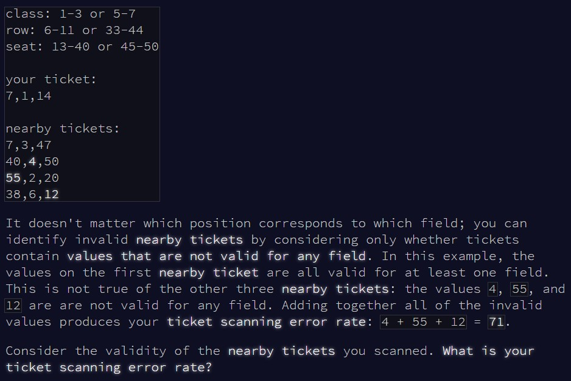

```{r setup, include=FALSE}
knitr::opts_chunk$set(echo = TRUE)
```

# Part 1

## Challenge

\
\
\

Today, we're back to looking for valid inputs based on a set of conditions.
Let's see if we can figure this one out...

## Solution

The big advantage here is that tickets are invalid only if at least one of their
values is not in any valid range. This means that we don't have to worry about
allocating possible ranges for each values (at least for the time being...).
Instead, we'll simply create a "total range" which regroups all the possible
ranges. If a value is not in this "total range", then we know that it's not in
any of the single ranges, and therefore it's invalid!

The trickiest part for this section was to convert the input to a usable format.
This involved a bunch of `strsplit()` and `gsub()`, and I'm sure it's not the
most elegant solution, but it works!

```{r solution1}

check_tickets = function(input_ranges, input_tickets){
  
  #create the "total range"
  valid_range = c()
  
  #combine all values from all ranges
  for(i in seq(1, length(input_ranges), 2)){
    
    valid_range = c(valid_range, input_ranges[i]:input_ranges[i+1])
    
  }
  
  #remove duplicates to streamline
  valid_range = unique(valid_range)  
  
  #vector to store invalid values from tickets
  invalid_values = c()
  
  #go through each ticket
  for(ticket in input_tickets){
    
    #extract all values
    values = as.numeric(unlist(stringr::str_extract_all(ticket, "\\d+")))
    
    #if a value is not in the "total range", then it's invalid!
    invalid_values = c(invalid_values, values[!values %in% valid_range])
    
  }
  
  #return the sum of all invalid values
  sum(invalid_values)
  
}

```

Let's try with the example first:

```{r test_solution1}

input = readLines(here::here("inputs", "input16ex.txt"))
input = paste(input, collapse = " ")

#some reformatting to make the input easier to work with
input_ranges = unlist(strsplit(input, "  "))[1]
input_ranges = as.numeric(unlist(stringr::str_extract_all(input_ranges, "\\d+")))

input_tickets = unlist(strsplit(input, "  "))[3]
input_tickets = unlist(strsplit(input_tickets, " "))[-c(1,2)]

check_tickets(input_ranges, input_tickets)

```

All good! And now with the main input:

```{r result1}

input = readLines(here::here("inputs", "input16.txt"))
input = paste(input, collapse = " ")

input_ranges = unlist(strsplit(input, "  "))[1]
input_ranges = as.numeric(unlist(stringr::str_extract_all(input_ranges, "\\d+")))

input_tickets = unlist(strsplit(input, "  "))[3]
input_tickets = unlist(strsplit(input_tickets, " "))[-c(1,2)]

check_tickets(input_ranges, input_tickets)


```

That worked too!


# Part 2

## Challenge

\

Now, we're forced to assign ranges to each values...

## Solution

Unfortunately, I ran out of time before I could figure something out for this
section. My original thought was to calculate all possible order combinations of 
ranges, then go through each of them and stop as soon as we find a combination
which works for all values in all tickets. I used `expand.grid()` to work out
all combinations, and that solution actually worked with the example. However,
the problem was that there were too many ranges in the main input, and therefore
too many possible combinations to store in memory...

I think I could have tried to instead check what ranges were valid for each
value in a ticket, each time narrowing down the order whenever there was only
one valid range for a single value. Maybe I'll come back to this later, but
for now I'll let this star go!

```{r solution2}

# check_tickets2 = function(input_ranges, input_tickets){
#   
#   input_ranges_val = as.numeric(unlist(stringr::str_extract_all(input_ranges, "\\d+")))
#   
#   input_ranges_names = gsub(" or ", "", input_ranges)
#   input_ranges_names = gsub("[^[:alnum:] ]", "", input_ranges_names)
#   input_ranges_names = gsub("*[0-9]*", "", input_ranges_names)
#   input_ranges_names = unlist(strsplit(input_ranges_names, "  "))
#   
#   valid_range = c()
#   
#   for(i in seq(1, length(input_ranges_val), 2)){
#     
#     valid_range = c(valid_range, input_ranges_val[i]:input_ranges_val[i+1])
#     
#   }
#   
#   valid_range = unique(valid_range)
#   
#   invalid_tickets = c()
#   
#   for(j in 1:length(input_tickets)){
#     
#     ticket = input_tickets[j]
#     values = as.numeric(unlist(stringr::str_extract_all(ticket, "\\d+")))
#     
#     if(!all(values %in% valid_range)){
#       invalid_tickets = c(invalid_tickets, j)
#     }
#   }
#   
#   input_tickets = input_tickets[-invalid_tickets]
#   
#   # combinations = expand.grid(rep(list(c(1:length(input_ranges_names))), length(input_ranges_names)))
#   # combinations = combinations[apply(combinations, 1, function(x) length(unique(x)) == length(x)),]
#   
#   repeat{
#     
#     test_comb = sample(c(1:length(input_ranges_names)))
#     trigger = FALSE
#     
#     for(j in 1:length(input_tickets)){
#       
#       ticket = input_tickets[j]
#       values = as.numeric(unlist(stringr::str_extract_all(ticket, "\\d+")))
#       
#       for(k in 1:length(values)){
#         
#         test_value = values[k]
#         test_range = input_ranges_val[(test_comb[k]* 4 - 3):(test_comb[k]*4)]
#         
#         
#         if(!test_value %in% c(test_range[1]:test_range[2],
#                               test_range[3]:test_range[4])){
#           trigger = TRUE
#           break
#         }
#         
#       }
#       
#       if(trigger) break
#     }
#     
#     if(!trigger) break
#     
#   }
#   
#   input_ranges_names[test_comb]
#   
# }
# 

```


```{r test_solution2}

# input = readLines(here::here("inputs", "input16ex2.txt"))
# input = paste(input, collapse = " ")
# 
# input_ranges = unlist(strsplit(input, "  "))[1]
# 
# input_tickets = unlist(strsplit(input, "  "))[3]
# input_tickets = unlist(strsplit(input_tickets, " "))[-c(1,2)]
# 
# good_names = check_tickets2(input_ranges, input_tickets)


```


```{r result2}

# input = readLines(here::here("inputs", "input16.txt"))
# input = paste(input, collapse = " ")
# 
# input_ranges = unlist(strsplit(input, "  "))[1]
# 
# input_tickets = unlist(strsplit(input, "  "))[3]
# input_tickets = unlist(strsplit(input_tickets, " "))[-c(1,2)]
# 
# my_ticket = unlist(strsplit(input, "  "))[2]
# my_ticket = as.numeric(unlist(stringr::str_extract_all(my_ticket, "\\d+")))
# 
# 
# good_names = check_tickets2(input_ranges, input_tickets)
# 
# format(prod(my_ticket[grepl("departure", good_names)]), scientific = F)

```

