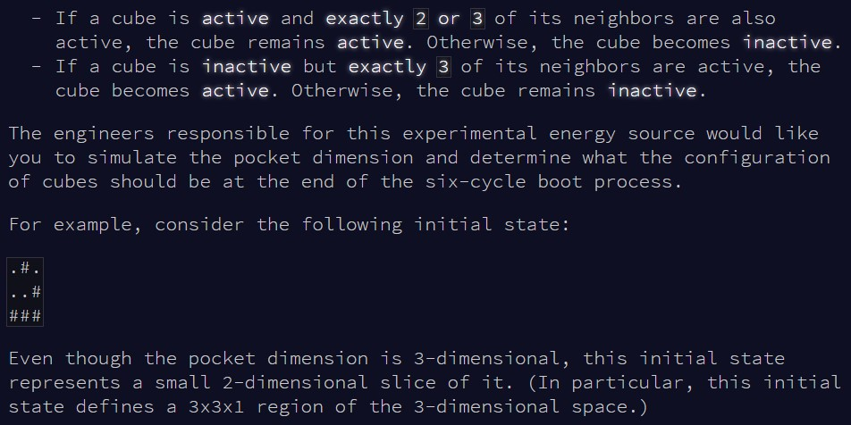
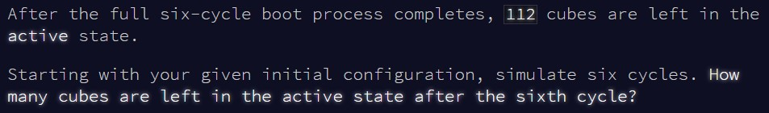
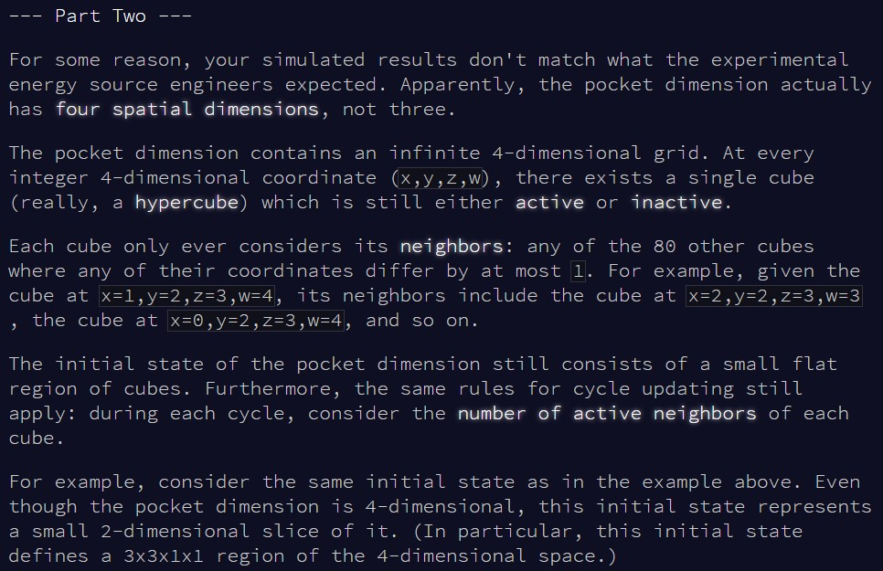
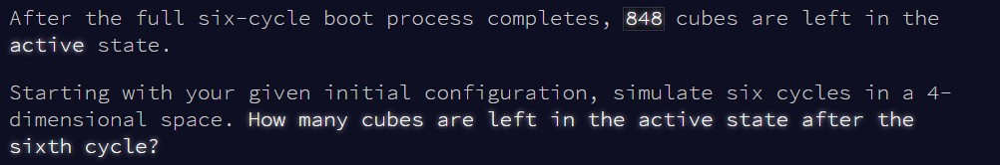

```{r setup, include=FALSE}
knitr::opts_chunk$set(echo = TRUE)
```

# Part 1

## Challenge

\
\
\

Today's problem reminded me of
[day 11](https://htmlpreview.github.io/?https://github.com/qleclerc/adventofcode20/blob/master/reports/day11.html).
We're again updating values based on their neighbours, but this time in 3D space! 

## Solution

I thought of a more practical approach this time to look at the neighbours of
any given value. `R` has the object type `array` to work with multiple
dimensions, which is really convenient here (as each value in an array "A" will
be accessed by it's x, y and z position: `A[x,y,z]`). For a value at a position
(x,y,z), I can extract the chunk of the 3D space which includes all its
neighbours by extending x, y and z by one step in both directions. In other
words, the chunk of 3D space "A"  which includes the value at x,y,z and all its 
neighbours is indexed as: `A[(x-1):(x+1), (y-1):(y+1), (z-1):(z+1)]`.

The last trick is to use the fact that we're only going through 6 cycles. Even
if the 3D space is infinite, in reality over 6 steps there is only a certain
range that we will reach (as we can ignore all the 3D space which only has inactive
values). That means we can pre-allocate our space, making sure it's big enough
to accomodate values for 6 steps. The advantage of this is that we won't need
to worry about extending our array at each step to evaluate neighbouring values,
while still maintaining a reasonable speed (as the array isn't massive).

Let's go!

```{r solution1}

cycle_space = function(space){
  
  #go through the 6 cycles
  for(reps in 1:6){
    
    #as the new space is updated everywhere simultaneously, we store the old space
    old_space = space
    
    #go through each value in the space
    for(i in 2:(dim(space)[1]-1)){
      for(j in 2:(dim(space)[2]-1)){
        for(k in 2:(dim(space)[3]-1)){
          
          #extract the chunk of array containing the value and its neighbours
          neighbours = old_space[(i-1):(i+1),(j-1):(j+1),(k-1):(k+1)]
          #extract the value
          value = neighbours[2,2,2]
          #ignore the value in the neighbour count!
          neighbours[2,2,2] = "e"
          
          #how many neighbours are active?
          active_neighbours = sum(neighbours == "#")
          
          #update the value if it meets a condition
          if(value == "." & active_neighbours == 3){
            space[i,j,k] = "#"
          }
          if(value == "#" & !(active_neighbours %in% c(2,3))){
            space[i,j,k] = "."
          }
        }
      }
    }
  }
  
  #return the number of active positions
  sum(space == "#")
  
}

```

A bit of formatting needed to create the array before passing it to the function.
I chose these sizes because it's impossible for the active values to reach
further than this in only 6 steps (as I'm making them start in the centre of
this array).

```{r test_solution1}

#extend everything
input = readLines(here::here("inputs", "input17ex.txt"))
input = unlist(strsplit(input, ""))
input = matrix(input, nrow = sqrt(length(input)), byrow = T)

#extend the input to a larger 2d matrix, with starting values in the centre
input = rbind(matrix(".", nrow = 8, ncol = ncol(input)),
              input,
              matrix(".", nrow = 8, ncol = ncol(input)))
input = cbind(matrix(".", nrow = nrow(input), ncol = 8),
              input,
              matrix(".", nrow = nrow(input), ncol = 8))

#create the total 3D space, with the appropriate dimensions
space = array(".", dim = c(nrow(input),ncol(input),17))
#put the starting values in the centre of this 3D space
space[,,8] = input

cycle_space(space)

```

Works fast! The 3D space size will be a bit bigger with the main input, but it still
shouldn't take long.

```{r result1}

input = readLines(here::here("inputs", "input17.txt"))
input = unlist(strsplit(input, ""))
input = matrix(input, nrow = sqrt(length(input)), byrow = T)

input = rbind(matrix(".", nrow = 8, ncol = ncol(input)),
              input,
              matrix(".", nrow = 8, ncol = ncol(input)))
input = cbind(matrix(".", nrow = nrow(input), ncol = 8),
              input,
              matrix(".", nrow = nrow(input), ncol = 8))

space = array(".", dim = c(nrow(input),ncol(input),17))
space[,,8] = input

cycle_space(space)


```

Really fast! And we've solved part 1!


# Part 2

## Challenge

\
\

And now, we need to extend the space to 4D instead of 3D...

## Solution

... which we can do easily! Arrays in `R` can be created with any number of
dimensions. We only need to add in an extra nested loop to go through the 4th
dimension, ohter than that the solution from part 1 should still work.

```{r solution2}

cycle_space2 = function(space){
  
  #all same as above
  
  for(reps in 1:6){
    
    old_space = space
    
    for(i in 2:(dim(space)[1]-1)){
      for(j in 2:(dim(space)[2]-1)){
        for(k in 2:(dim(space)[3]-1)){
          #just add in this extra nested level for the 4th dimension!
          for(l in 2:dim(space)[4]-1){
            
            neighbours = old_space[(i-1):(i+1),(j-1):(j+1),(k-1):(k+1),(l-1):(l+1)]
            value = neighbours[2,2,2,2]
            neighbours[2,2,2,2] = "e"
            
            active_neighbours = sum(neighbours == "#")
            
            if(value == "." & active_neighbours == 3){
              space[i,j,k,l] = "#"
            }
            if(value == "#" & !(active_neighbours %in% c(2,3))){
              space[i,j,k,l] = "."
            }
          }
        }
      }
    }
  }
  
  sum(space == "#")
  
}


```

I don't think this should massively increase run time, but keeping my fingers
crossed...

```{r test_solution2}

#extend everything
input = readLines(here::here("inputs", "input17ex.txt"))
input = unlist(strsplit(input, ""))
input = matrix(input, nrow = sqrt(length(input)), byrow = T)

#extend the input to a larger 2d matrix, with starting values in the centre
input = rbind(matrix(".", nrow = 8, ncol = ncol(input)),
              input,
              matrix(".", nrow = 8, ncol = ncol(input)))
input = cbind(matrix(".", nrow = nrow(input), ncol = 8),
              input,
              matrix(".", nrow = nrow(input), ncol = 8))

#create the total 4D space, with the appropriate dimensions
space = array(".", dim = c(nrow(input),ncol(input),17,17))
#put the starting values in the centre of this 4D space
space[,,8,8] = input

cycle_space2(space)

```

Works fine with the example! And now with the main input:

```{r result2}

#extend everything
input = readLines(here::here("inputs", "input17.txt"))
input = unlist(strsplit(input, ""))
input = matrix(input, nrow = sqrt(length(input)), byrow = T)

input = rbind(matrix(".", nrow = 8, ncol = ncol(input)),
              input,
              matrix(".", nrow = 8, ncol = ncol(input)))
input = cbind(matrix(".", nrow = nrow(input), ncol = 8),
              input,
              matrix(".", nrow = nrow(input), ncol = 8))

space = array(".", dim = c(nrow(input),ncol(input),17,17))
space[,,8,8] = input

cycle_space2(space)


```

It only took a couple of seconds! Overall, I'm proud of my solution today - 
perhaps my best solution so far!
