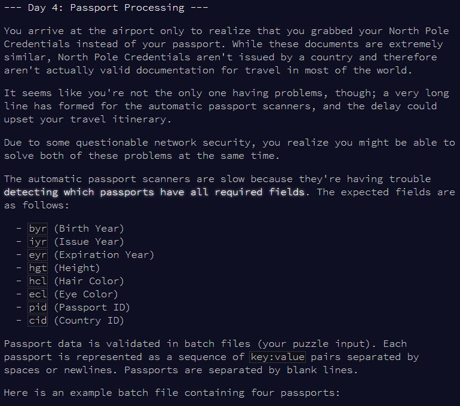
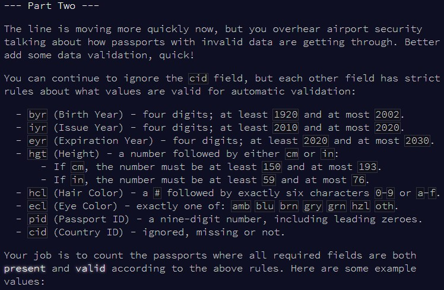

```{r setup, include=FALSE}
knitr::opts_chunk$set(echo = TRUE)
```

# Part 1

## Challenge

\


## Solution


```{r solution1}

play_cards = function(all_decks){
  
  fight_cards = function(deck1, deck2){
    
    if(deck1[1] > deck2[1]){
      deck1 = c(deck1, deck1[1], deck2[1])
      deck1 = deck1[-1]
      deck2 = deck2[-1]
    } else {
      deck2 = c(deck2, deck2[1], deck1[1])
      deck2 = deck2[-1]
      deck1 = deck1[-1]
    }
    
    list(deck1, deck2)
    
  }
  
  repeat{
    
    all_decks = fight_cards(all_decks[[1]], all_decks[[2]])
    
    if(length(all_decks[[1]]) == 0){
      
      winner_deck = all_decks[[2]]
      winner_deck = winner_deck * seq(length(winner_deck), 1, -1)
      cat("Player 2 wins! Score:", sum(winner_deck))
      break
    }
    
    if(length(all_decks[[2]]) == 0){
      
      winner_deck = all_decks[[1]]
      winner_deck = winner_deck * seq(length(winner_deck), 1, -1)
      cat("Player 1 wins! Score:", sum(winner_deck))
      break
    }
    
  }
  
}

```


```{r test_solution1}

deck1 = c(9,2,6,3,1)

deck2 = c(5,8,4,7,10)

all_decks = list(deck1, deck2)

play_cards(all_decks)

```


```{r result1}

tt = readLines(here::here("inputs", "input22.txt"))

deck1 = tt[2:(which(tt == "")-1)]
deck2 = tt[(which(tt == "")+2):length(tt)]

deck1 = as.numeric(deck1)
deck2 = as.numeric(deck2)

all_decks = list(deck1, deck2)

play_cards(all_decks)

```


# Part 2

## Challenge

\


## Solution


```{r solution2}


```


```{r test_solution2}


```


```{r result2}


```

