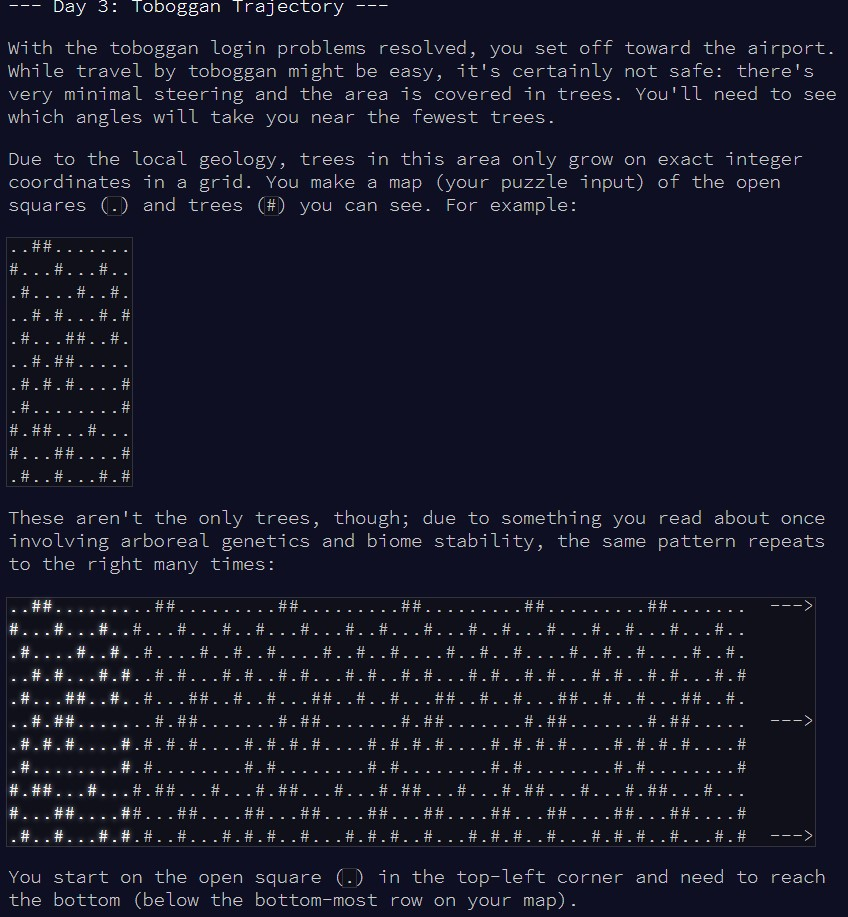
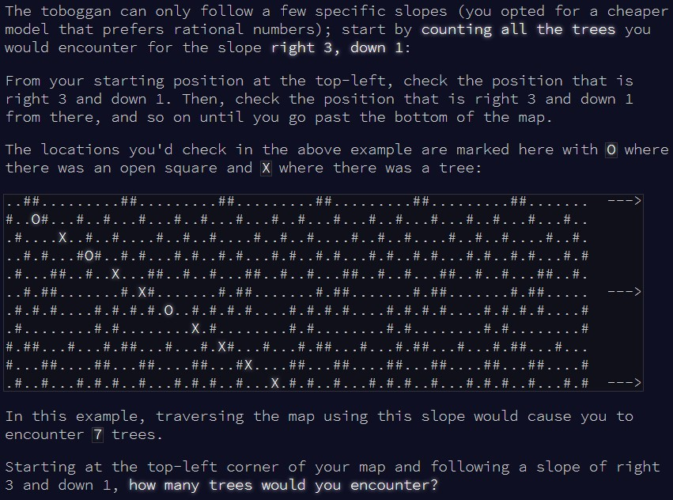
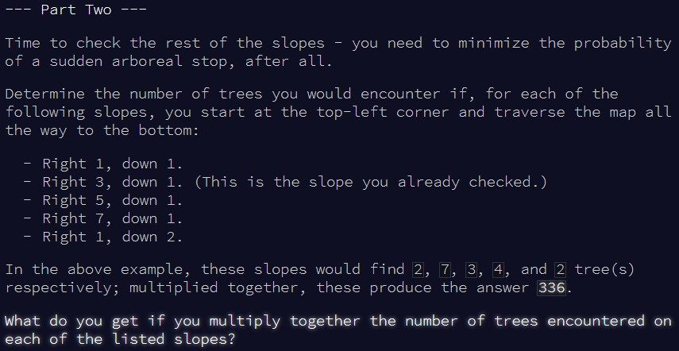

```{r setup, include=FALSE}
knitr::opts_chunk$set(echo = TRUE, warning = FALSE)
```

# Part 1

## Challenge

\
\

Today, we're trying to see how many trees we're going to crash into! Luckily we're
not worried about calculating a trajectory to avoid them, that would have been 
trickier...


## Solution

To solve this, I decided to convert the input to a matrix, and work by moving
from one position to the next, evaluating at each step if we are hitting a tree.
In R, matrix indexing starts from the top left, which conveniently matches the
problem scenario. Indexing then increases by going down and right, which again
aligns with the problem scenario. So, we're going to work with `position["x"]`,
equivalent to the **column** we're in, and `position["y"]`, equivalent to the 
**row**.

2 points to bear in mind:
- The number of columns in the input is limited, and we'd go over this number in
the loop before we manage to reach the last row. To fix that, you could paste
multiple copies of the input matrix together until you have enough columns, but
I chose to simply adjust the `position["x"]` in the loop. If `position["x"]`
becomes greater than the number of **columns**, I reset it by subtracting 
`ncol(input)` from it, giving me the new `positon["x"]`.
- When you fetch a value in a matrix in `R`, you need to first provide the **row**,
then the **column** (`matrix[row, column]`). In our case, we would need to phrase it
like so: `matrix[position["y"], position["x"]]`. A bit counterintuitive, as you'd
expect it to be the other way around, so I admit I got it wrong on the first 
try...

Here's my solution for part 1:

```{r solution1}

count_trees = function(input){
  
  #starting position
  position = c(x = 1, y = 1)
  
  #counter for number of trees
  trees_counter = 0
  
  #keep going until we've reached the "bottom" (ie last row) of the matrix
  while(position["y"] < nrow(input)){
    
    #update positions x and y based on the problem scenario
    position["x"] = position["x"] + 3
    position["y"] = position["y"] + 1

    #safety check to reset position x in case it goes over the number of columns
    if(position["x"] > ncol(input)) position["x"] = position["x"] - ncol(input)
    
    #check whether we have a tree at that position in the matrix
    if(input[position["y"], position["x"]] == "#") trees_counter = trees_counter + 1
    
  }
  
  trees_counter
  
}


```

It's a bit tricky to convert the puzzle input to a matrix, even the simple
example, so I'm importing it from a text file this time.

```{r test_solution1}

input = readLines(here::here("inputs", "input3ex.txt"))

input = matrix(unlist(strsplit(input, "")), nrow = length(input), byrow = T)

count_trees(input)

```

All good! Onto the real problem then:

```{r result1}

input = readLines(here::here("inputs", "input3.txt"))

input = matrix(unlist(strsplit(input, "")), nrow = length(input), byrow = T)

count_trees(input)

```

And that's part 1 done!


# Part 2

## Challenge

\

The problem remains the same, the only difference now is that we have to test 
different slopes, so different variations in `position["x"]` and `position["y"]`. 

## Solution

For this, I just added a new variable to the function, named "slope". Then, 
instead of fixing the variations in `position["x"]` and `position["y"]` at each
step, I tell the function to use the values in "slope". Finally, a quick loop
to go over the 5 different slopes, multiply all the trees counters together, and
we've got our result!

```{r solution2}

count_trees2 = function(input, slope){
  
  #starting position
  position = c(x = 1, y = 1)
  
  #counter for number of trees
  trees_counter = 0
  
  #keep going until we've reached the "bottom" (ie last row) of the matrix
  while(position["y"] < nrow(input)){
    
    #update positions x and y based on the "slope" variable
    position["x"] = position["x"] + slope["x"]
    position["y"] = position["y"] + slope["y"]

    #safety check to reset position x in case it goes over the number of columns
    if(position["x"] > ncol(input)) position["x"] = position["x"] - ncol(input)
    
    #check whether we have a tree at that position in the matrix
    if(input[position["y"], position["x"]] == "#") trees_counter = trees_counter + 1
    
  }
  
  trees_counter
  
}

```

Checking with the example...

```{r test_solution2}

input = readLines(here::here("inputs", "input3ex.txt"))

input = matrix(unlist(strsplit(input, "")), nrow = length(input), byrow = T)

#define the slopes to try
slopes = list(c(x = 1, y = 1),
              c(x = 3, y = 1),
              c(x = 5, y = 1),
              c(x = 7, y = 1),
              c(x = 1, y = 2))

#to progressively multiply the number of trees hit with each slope
result = 1

#test each slope
for(i in c(1:length(slopes))){
  
  trees_i = count_trees2(input, slope = slopes[[i]])

  result = result * trees_i
  
}

result

```

And finally, with the puzzle input:

```{r result2}

input = readLines(here::here("inputs", "input3.txt"))

input = matrix(unlist(strsplit(input, "")), nrow = length(input), byrow = T)

#define the slopes to try
slopes = list(c(x = 1, y = 1),
              c(x = 3, y = 1),
              c(x = 5, y = 1),
              c(x = 7, y = 1),
              c(x = 1, y = 2))

#to progressively multiply the number of trees hit with each slope
result = 1

#test each slope
for(i in c(1:length(slopes))){
  
  trees_i = count_trees2(input, slope = slopes[[i]])

  result = result * trees_i
  
}

result


```

That worked!
