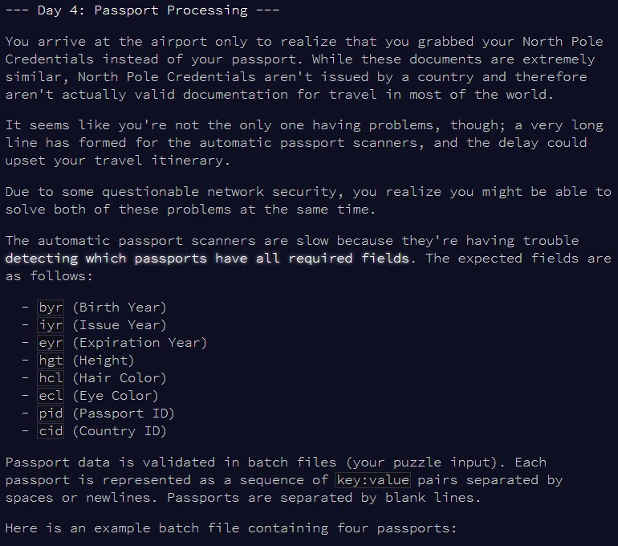

```{r setup, include=FALSE}
knitr::opts_chunk$set(echo = TRUE, warning = FALSE)
```

# Part 1

## Challenge

\
\

"More string analysis like day 2! Should be easy!" - famous last words :'(

## Solution

This first part is really straightforward in reality. With some good use of 
`paste()`, `strsplit()` and `gsub()`, we can quickly reformat the input to a
nice set of passports, with the fields clearly laid out.

Then, we need to go through each line, and extract the tag of each field. This
can be done with `strplit()` and a convenient use of `substring()`, as the 
field tags are always the first 3 characters.


```{r solution1}

check_passport = function(input){
  
  #store number of valid passwords
  good_passport = 0
  #fields that must be present
  check_fields = c("byr", "iyr", "eyr", "hgt", "hcl", "ecl", "pid")
  
  #check each passport
  for(i in 1:length(input)){
    
    #split all the fields
    passport = input[i]
    passport = unlist(strsplit(passport, " "))
    passport = substring(passport, 1, 3)
    
    #check whether all the required fields are present in the passport fields
    if(all(check_fields %in% passport)) good_passport = good_passport + 1
    
  }
  
  good_passport
  
}

```

Let's check this works with the example, we should only find 2 valid passports.

```{r test_solution1}

input = readLines(here::here("inputs", "input4ex.txt"))
input = paste(x = input, collapse="-")
input = unlist(strsplit(input, "--"))
input = gsub("-", " ", input)

check_passport(input)

```

All good! Onto the puzzle input then.

```{r result1}

input = readLines(here::here("inputs", "input4.txt"))
input = paste(x = input, collapse="-")
input = unlist(strsplit(input, "--"))
input = gsub("-", " ", input)

check_passport(input)


```

Part one is over, but I was not ready for part two...


# Part 2

## Challenge

\
\
\

Wow!! And just like that, this becomes a nightmare... We're going to have to
build a ton of checks to evaluate all the passports. This is going to cause
some headaches...


## Solution

The idea here is to convert each rule in the puzzle scenario to a logical
statement we can implement. I won't go too much into details here, comments are
provided in the code below, but this is typically a scenario where little
mistakes can screw everything up. The use of `browser()` to go through all the
steps of the function is highly recommended!!

```{r solution2}

check_passport2 = function(input){
  
  #store number of valid passwords
  good_passport = 0
  #fields that must be present
  check_fields = c("byr", "iyr", "eyr", "hgt", "hcl", "ecl", "pid")

  #go through  
  for(i in 1:length(input)){
    
    #separate the fields
    passport = input[i]
    passport = unlist(strsplit(passport, " "))
    
    #extract the field tags and values
    passport_field = substring(passport, 1, 3)
    passport_value = substring(passport, 5)
    
    #can already eliminate passports which don't have all the fields
    if(!all(check_fields %in% passport_field)) next
    
    #check value, to exit the loop below faster if something doesn't match
    fail = FALSE
    
    #go through each field
    for(j in c(1:length(passport_field))){
      
      #if I already picked up an invalid field, break from the loop
      if(fail) break
      
      #what field value are we evaluating?
      test_value = passport_value[j]
      
      #then, we look what the field tag is, to decide what our check should be
      
      #if it's birth year
      if(passport_field[j] == "byr"){
        
        test_value = as.numeric(test_value)
        
        if(is.na(test_value)){
          fail = TRUE
          next
        }
        
        if(!(test_value >= 1920 & test_value <= 2002)) fail = TRUE
        
      }
      #if it's issue year
      else if(passport_field[j] == "iyr"){
        
        test_value = as.numeric(test_value)
        
        if(is.na(test_value)){
          fail = TRUE
          next
        }
        
        if(!(test_value >= 2010 & test_value <= 2020)) fail = TRUE
        
      }
      #if it's expiry year
      else if(passport_field[j] == "eyr"){
        
        test_value = as.numeric(test_value)
        
        if(is.na(test_value)){
          fail = TRUE
          next
        }
        
        if(!(test_value >= 2020 & test_value <= 2030)) fail = TRUE
        
      }
      #if it's height
      else if(passport_field[j] == "hgt"){
        
        #need to split the test value into the units and real value
        unit = substring(test_value, nchar(test_value)-1, nchar(test_value))
        test_value = as.numeric(substring(test_value, 1, nchar(test_value)-2))
        
        if(is.na(test_value)){
          fail = TRUE
          next
        }
        
        if(unit == "cm" & test_value >= 150 & test_value <= 193){
          next
        } else if(unit == "in" & test_value >= 59 & test_value <= 76){
          next
        } else fail = TRUE
        
      }
      #if it's hair color
      else if(passport_field[j] == "hcl"){
        
        if(substring(test_value, 1, 1) != "#"){
          fail = TRUE
          next
        }
        
        if(nchar(test_value) != 7){
          fail = TRUE
          next
        }
        
      }
      #if it's eye color
      else if(passport_field[j] == "ecl"){
        
        if(!(test_value %in% c("amb", "blu", "brn", "gry",
                               "grn", "hzl", "oth"))) fail = TRUE
        
      }
      #if it's passport id
      else if(passport_field[j] == "pid"){
        
        if(nchar(test_value) != 9) fail = TRUE
        
      }
      else{
        #ie, passport field is cid, which we ignore
        next
      }
      
    }
    
    #if the passport didn't fail at least 1 check, it's valid!
    if(!fail) good_passport = good_passport + 1
    
  }
  
  good_passport
  
}


```

Let's see whether this works. With the first example, all passports should be
invalid, and in the second part they should all be valid.

```{r test_solution2}

input = readLines(here::here("inputs", "input4ex2.txt"))
input = paste(x=input, collapse="-")
input = unlist(strsplit(input, "--"))
input = gsub("-", " ", input)

check_passport2(input)

input = readLines(here::here("inputs", "input4ex3.txt"))
input = paste(x=input, collapse="-")
input = unlist(strsplit(input, "--"))
input = gsub("-", " ", input)

check_passport2(input)


```

Looks promising, fingers crossed this works for the puzzle input...

```{r result2}

input = readLines(here::here("inputs", "input4.txt"))
input = paste(x=input, collapse="-")
input = unlist(strsplit(input, "--"))
input = gsub("-", " ", input)

check_passport2(input)


```

Done! Now, I need more coffee to get rid of the headaches and actually do some
work!

