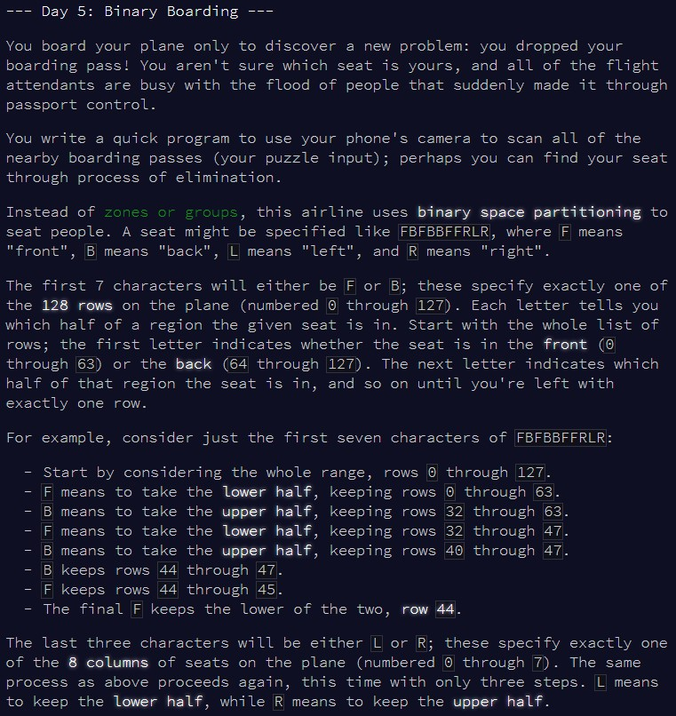
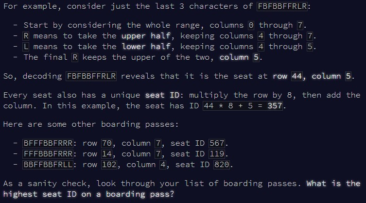
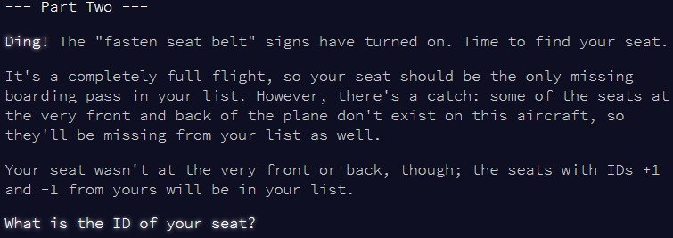

```{r setup, include=FALSE}
knitr::opts_chunk$set(echo = TRUE)
```

# Part 1

## Challenge

\
\

Another problem which relies on splitting a string and perform an action based
on the characters there! Starting to see a pattern...

## Solution

At first, I thought about some sort of complicated sequencing I would have to do
to decide which set of numbers to keep at each round, then I properly woke up
and realized that this was simply all about the median! At each step, we're 
essentially splitting a set of numbers in two, then deciding whether to keep the
left set or right set. The middle point of the set will always be the median, so
it's just a question of whether we want the median to be the new smallest value
of the set, or the largest.

Let's implement a few `for` loops, and we should be good!

```{r solution1}

find_id = function(input){
  
  #vector to store the seat ids
  store_id = rep(0, length(input))
  
  #go through each boarding pass
  for(i in 1:length(input)){
    
    test_input = input[i]
    
    #extract the row sequence
    row_seq = substring(test_input, 1, 7)
    row_min = 0
    row_max = 127
    
    #extract the column sequence
    col_seq = substring(test_input, 8)
    col_min = 0
    col_max = 7
    
    #go through the 7 partitioning steps to find the correct row
    for(j in 1:7){
      
      if(substring(row_seq, j, j) == "F") row_max = floor(median(row_min:row_max))
      else row_min = ceiling(median(row_min:row_max))
      
    }
    
    #go through the 3 partioning steps to find the correct column
    for(k in 1:3){
      
      if(substring(col_seq, k, k) == "L") col_max = floor(median(col_min:col_max))
      else col_min = ceiling(median(col_min:col_max))
      
    }
    
    #calculate the seat id, and store it
    store_id[i] = row_max*8 + col_max
    
  }
  
  #finally, return the highest seat id to solve the puzzle!
  max(store_id)
  
}


```

As always, let's first check this works with the example:

```{r test_solution1}

input = c("BFFFBBFRRR", "FFFBBBFRRR", "BBFFBBFRLL")
find_id(input)


```

And now, for the main solution...

```{r result1}

input = readLines(here::here("inputs", "input5.txt"))
find_id(input)

```


# Part 2

## Challenge

\

Not a huge jump in complexity here (unlike [day 4](https://htmlpreview.github.io/?https://github.com/qleclerc/adventofcode20/blob/master/reports/day4.html)
which gave us headaches!), so should be fairly quick to adapt the code.

## Solution

Here, instead of only the maximum seat id, we're interested in recording all the
seat ids, the searching for the one missing - that'll be ours. The puzzle says
that some front and back seats don't exist, but the easy way to not worry about
them is to just search the sequence from the smallest id we calculated, to the
largest. As soon as we find one missing number in that sequence, we can stop,
and take our seat on the plane!

```{r solution2}

find_id2 = function(input){
  
  #vector to store the seat ids
  store_id = rep(0, length(input))
  
  #go through each boarding pass
  for(i in 1:length(input)){
    
    test_input = input[i]
    
    #extract the row sequence
    row_seq = substring(test_input, 1, 7)
    row_min = 0
    row_max = 127
    
    #extract the column sequence
    col_seq = substring(test_input, 8)
    col_min = 0
    col_max = 7
    
    #go through the 7 partitioning steps to find the correct row
    for(j in 1:7){
      
      if(substring(row_seq, j, j) == "F") row_max = floor(median(row_min:row_max))
      else row_min = ceiling(median(row_min:row_max))
      
    }
    
    #go through the 3 partioning steps to find the correct column
    for(k in 1:3){
      
      if(substring(col_seq, k, k) == "L") col_max = floor(median(col_min:col_max))
      else col_min = ceiling(median(col_min:col_max))
      
    }
    
    #calculate the seat id, and store it
    store_id[i] = row_max*8 + col_max
    
  }
  
  #look at the sequence from the smallest id to the largest
  min_id = min(store_id)
  max_id = max(store_id)
  
  #stop as soon as we find a missing number in that sequence
  for(l in min_id:max_id){
    if(!l %in% store_id){
      cat("Your seat is", l)
      break
    }
  }
}


```

No example given for this one, so let's go straight onto the puzzle input:

```{r result2}

input = readLines(here::here("inputs", "input5.txt"))
find_id2(input)

```

We've found our seat! Now, we can relax, until the next puzzle tomorrow...
