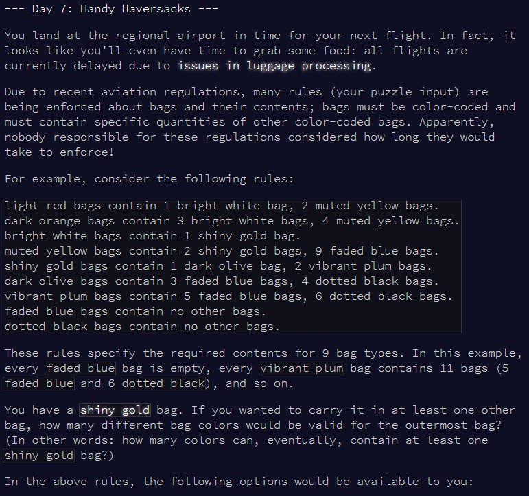
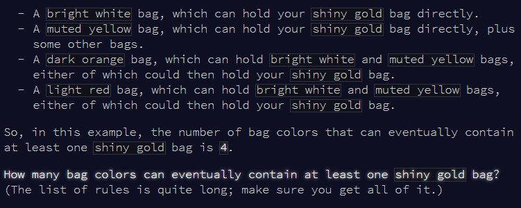
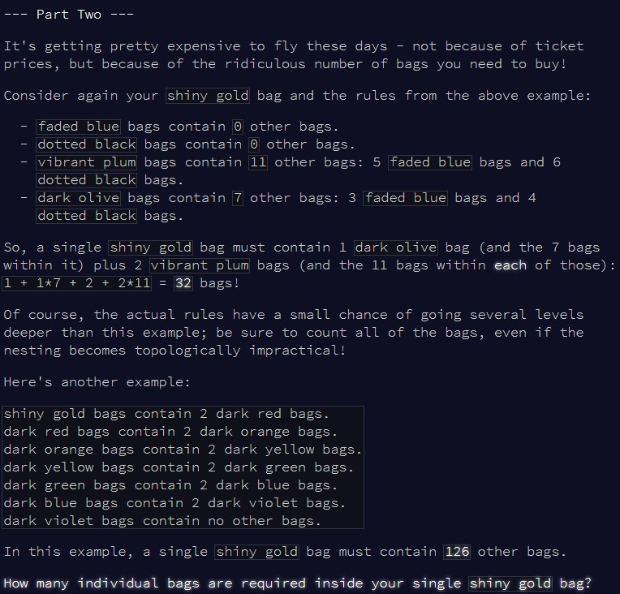

```{r setup, include=FALSE}
knitr::opts_chunk$set(echo = TRUE)
```

# Part 1

## Challenge

\
\

Today is an interesting challenge, because I failed to solve it since I made an
assumption which I thought was reasonable, but incorrect in the end...

## Solution

Upon seeing the problem, I decided that the question was equivalent to: how many
bags are big enough to contain at least one shiny gold bag? In another words:
how many bags does each bag contain, and how many bags therefore have a capacity
greater than the shiny gold bag?

I really believed this was a correct way to rephrase the problem, since if a bag
*x* contained a shiny gold bag, then the capacity of bag *x* must be at least
equal to the capacity of a shiny gold bag. So, I built the code below to 
convert bags to numbers, each time repeating the process of replacing bags by 
their values until no more colors were left, only numbers. Then, a quick 
`eval(parse())` (not best practice, I know!) gives me the total capacity of each
bag.

```{r solution1}

find_bags = function(input){
  
  #I've formatted the input to be a dataframe with 2 columns:
  #-color of the bag
  #-contents of that bag
  
  #while there are still colors (1st column) in the contents of bags (2nd column)...
  while(any(sapply(input$var, function(x) grepl(x, input$val)))){
    
    #go through each bag and update the contents
    for(i in 1:nrow(input)){
      
      #extract the colour of bag i
      colour_i = input$var[i]
      #extract the contents of bag i
      value_i = paste0("* (", input$val[i], ") ")
      
      #replace the bag by its contents everywhere in the dataset
      input$val = gsub(colour_i,
                       value_i, 
                       input$val)

    }
    
  }
  
  #eval each line to calculate the bag capacity
  input$val = sapply(input$val, function(x) eval(parse(text = x)))

  #count how many bags have enough space for a shiny gold bag
  sum(input$val > input$val[input$var == "shiny gold"], na.rm = T)
  
}


```

Happy with myself, I then tested this with the example...

```{r test_solution1}

input = readLines(here::here("inputs", "input7ex.txt"))
input = gsub(" bags", "", input)
input = gsub(" bag", "", input)
input = gsub("\\.", "", input)
input = gsub(", ", " + ", input)

input = unlist(strsplit(input, "contain "))
input = trimws(input)
input = data.frame(var = input[seq(1, length(input), 2)],
                   val = input[seq(2, length(input), 2)])

input$val = sapply(input$val, function(x){
  paste0(x, " + ", sum(as.numeric(unlist(stringr::str_extract_all(x, "\\d+")))))
})

input$val = gsub("no other", "0", input$val)

find_bags(input)

```

And it worked! Nice! So then I ran it with the main puzzle input:

```{r result1}

input = readLines(here::here("inputs", "input7.txt"))
input = gsub(" bags", "", input)
input = gsub(" bag", "", input)
input = gsub("\\.", "", input)
input = gsub(", ", " + ", input)

input = unlist(strsplit(input, "contain "))
input = trimws(input)
input = data.frame(var = input[seq(1, length(input), 2)],
                   val = input[seq(2, length(input), 2)])

input$val = sapply(input$val, function(x){
  paste0(x, " + ", sum(as.numeric(unlist(stringr::str_extract_all(x, "\\d+")))))
})

input$val = gsub("no other", "0", input$val)

find_bags(input)


```

... and it didn't give me the correct answer. I thought about it some more and
concluded that what the problem actually wanted was to know which bags had a
shiny gold bag in their hierarchy, not which bags *could* have a shiny gold bag.
Ie, not all bags big enough for a shiny gold bag *actually* contained a shiny
gold bag.

Unfortunately, I ran out of time here, so ended up using the solution by
Emil Hvitfeldt ([here](https://twitter.com/Emil_Hvitfeldt/status/1335833621429534722))
to see if I could at least solve part 2.

```{r alt1}

#DISCLAIMER this is not my solution!!
#Full credits to Emil Hvitfeldt for this solution
#https://twitter.com/Emil_Hvitfeldt/status/1335833621429534722 

library(stringr)

input = readLines(here::here("inputs", "input7.txt"))

containing_bag = function(x){
  
  str_extract(str_subset(input, paste0(".+", x)), "^.+?bag")
  
}

used_bags = c()
new_bags = "shiny gold bag"

repeat{
  newer_bags = unique(unlist(lapply(new_bags, containing_bag)))
  
  if(length(newer_bags) == 0){
    used_bags = c(used_bags, new_bags)
    break
  }
  
  used_bags = c(used_bags, new_bags)
  new_bags = setdiff(newer_bags, used_bags)
}

length(setdiff(used_bags, "shiny gold bag"))

```


# Part 2

## Challenge

\

And now, part 2 asks us to count the size of the shiny gold bag!! Let's see if
my original approach above was correct then

## Solution


```{r solution2}

find_bags2 = function(input){
  
  while(any(sapply(input$var, function(x) grepl(x, input$val)))){
    
    for(i in 1:nrow(input)){
      
      colour_i = input$var[i]
      value_i = paste0("* (", input$val[i], ") ")
      
      input$val = gsub(colour_i,
                       value_i, 
                       input$val)

    }
    
  }
  
  input$val = sapply(input$val, function(x) eval(parse(text = x)))

  #all exactly the same as above, but return the size of the shiny gold bag now
  input$val[input$var == "shiny gold"]
}

```

Let's check with the example...

```{r test_solution2}

input = readLines(here::here("inputs", "input7ex.txt"))
input = gsub(" bags", "", input)
input = gsub(" bag", "", input)
input = gsub("\\.", "", input)
input = gsub(", ", " + ", input)

input = unlist(strsplit(input, "contain "))
input = trimws(input)
input = data.frame(var = input[seq(1, length(input), 2)],
                   val = input[seq(2, length(input), 2)])

input$val = sapply(input$val, function(x){
  paste0(x, " + ", sum(as.numeric(unlist(stringr::str_extract_all(x, "\\d+")))))
})

input$val = gsub("no other", "0", input$val)

find_bags2(input)

```

Okay, and now for the main input...

```{r result2}

input = readLines(here::here("inputs", "input7.txt"))
input = gsub(" bags", "", input)
input = gsub(" bag", "", input)
input = gsub("\\.", "", input)
input = gsub(", ", " + ", input)

input = unlist(strsplit(input, "contain "))
input = trimws(input)
input = data.frame(var = input[seq(1, length(input), 2)],
                   val = input[seq(2, length(input), 2)])

input$val = sapply(input$val, function(x){
  paste0(x, " + ", sum(as.numeric(unlist(stringr::str_extract_all(x, "\\d+")))))
})

input$val = gsub("no other", "0", input$val)

find_bags2(input)


```

That worked! So, not completely useless... From what I gathered by looking at 
answers from other people, I should have implemented a recursive function to
solve part 1, to essentially go down all the hierarchy of each bag, and identify
which ones contained the shiny gold one. But I ran out of time unfortunately, so
that will be for another time!